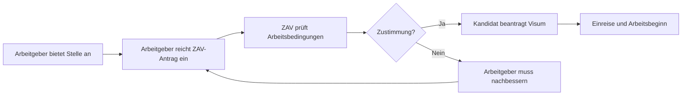
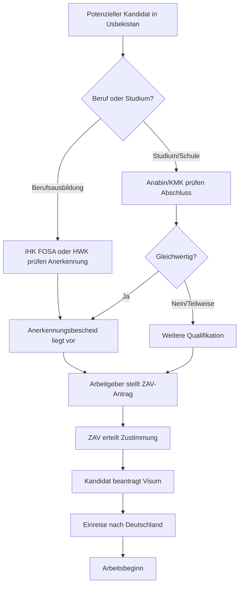

# Anabin, ZAV, KMK und die Berufsanerkennung – Zusammenspiel erklärt

## Warum dieser Artikel?

In vielen Informationsseiten werden **Anabin, ZAV, KMK, IHK FOSA und HWK** separat behandelt. Für die Praxis ist aber entscheidend, wie diese Systeme zusammenspielen. Dieser Artikel zeigt, welche Stelle für welchen Nachweis zuständig ist und in welcher Reihenfolge die Verfahren ablaufen.

---

## Die vier Säulen auf einen Blick

| System | Was wird geprüft? | Relevant für |
|--------|-------------------|--------------|
| **Anabin** | Gleichwertigkeit ausländischer **Hochschulabschlüsse** und Schulabschlüsse | Akademiker, Ingenieure, Techniker mit Studium |
| **KMK** | Anerkennung ausländischer **Schulabschlüsse** für Hochschulzugang | Personen mit weiterführenden Schulabschlüssen |
| **IHK FOSA / HWK** | Anerkennung ausländischer **Berufsabschlüsse** | Fachkräfte mit Ausbildung (Hauptzielgruppe von AATRIUM) |
| **ZAV** | Zustimmung der Bundesagentur für Arbeit zur **Beschäftigung** eines ausländischen Arbeitnehmers | Alle ausländischen Fachkräfte vor Arbeitsbeginn |

!!! info "Kernbotschaft"
    **Anabin/KMK** prüfen **Schul- und Studienabschlüsse**. **IHK FOSA/HWK** prüfen **Berufsausbildungen**. **ZAV** prüft die **Arbeitsmarktzulassung**. Diese Verfahren laufen parallel oder nacheinander, nicht gegeneinander.

---

## 1. Anabin – Datenbank für ausländische Bildungsabschlüsse

### Was ist Anabin?

**Anabin** ist eine Online-Datenbank der Kultusministerkonferenz (KMK). Sie gibt Auskunft darüber, wie ausländische **Schul- und Hochschulabschlüsse** in Deutschland bewertet werden.

- Website: https://anabin.kmk.org (live verifiziert)
- Betreiber: Kultusministerkonferenz (KMK)
- Zielgruppe: Akademiker, Studienbewerber, Arbeitgeber, Behörden

### Die drei Bewertungsstufen (Hochschulabschlüsse)

| Stufe | Bedeutung | Konsequenz |
|-------|-----------|------------|
| **H+** | Abschluss wird als gleichwertig anerkannt | Kann direkt für Beruf oder Studium genutzt werden |
| **H-** | Abschluss wird nicht als gleichwertig anerkannt | Weitere Qualifikation oder Anerkennungsverfahren nötig |
| **H+/-** | Einzelfallprüfung durch zuständige Stelle | Anerkennung hängt von Einzelumständen ab |

### Wann ist Anabin relevant?

| Szenario | Relevanz |
|----------|----------|
| Usbekischer Ingenieur mit Hochschulabschluss | Sehr relevant – Anabin prüft Gleichwertigkeit des Studiums |
| Usbekischer Maurer mit Lehre | Nicht relevant für die Berufsanerkennung (dafür HWK) |
| Usbekischer Techniker mit Fachschulabschluss | Teilweise relevant – kann Hinweise geben, ersetzt aber nicht die Berufsanerkennung |
| Person will in Deutschland studieren | Relevant für Hochschulzugang |

!!! warning "Wichtig"
    Anabin ersetzt **keine** offizielle Anerkennung. Es ist eine Orientierungshilfe. Für rechtsverbindliche Entscheidungen ist die zuständige Anerkennungsstelle zuständig.

### Beispiel aus der Live-Recherche (Juli 2026)

Auf Anabin (https://anabin.kmk.org) finden sich für **Usbekistan** folgende, tatsächlich im System vorhandene Hochschulabschlüsse (Auswahl):

| Usbekischer Abschluss (Abschlusstyp) | Deutscher Vergleich | Typische Nutzung |
|---|---|---|
| **Bakalavr** | Bachelor | Erster Hochschulabschluss, ca. 4 Jahre |
| **Magistr** | Master | Aufbauend auf Bakalavr, ca. 2 Jahre |
| **Mutaxassis** | Diplom (Fach-)Hochschule | Qualifizierter Abschluss, teilweise 5-jährig |
| **Fan doktori / falsafa doktori** | Promotion (PhD) | Doktorgrad |

**Studienrichtungen, die für AATRIUM-Kandidaten relevant sein können:**

- `bino va inshootlar qurilishi` → Bauingenieurwesen / Construction of Buildings and Structures
- `agroinjeneriya` → Agrar-Ingenieurwesen
- `elektr texnikasi, elektr mexanikasi va elektr texnologiyalari` → Elektrotechnik / Elektromechanik
- `avtomobilsozlik va traktorsozlik` → Fahrzeug-/Traktorentechnik

!!! note "Was bedeutet das in der Praxis?"
    Ein usbekischer Kandidat mit **Bakalavr in Bino va inshootlar qurilishi** (Bauingenieurwesen) erscheint in Anabin als Hochschulabschluss. Ob er für eine konkrete deutsche Position als Bauingenieur anerkannt wird, hängt aber von der **IHK FOSA** (für Ingenieure) oder der **zuständigen Kammer** ab, nicht von Anabin allein.

---

## 2. KMK – Kultusministerkonferenz

### Was ist die KMK?

Die **Kultusministerkonferenz (KMK)** ist die Vereinigung der Bildungsministerien der Bundesländer. Sie legt gemeinsame Standards für Schulen und Hochschulen fest. Die KMK betreibt Anabin und regelt die Anerkennung ausländischer Schulabschlüsse.

!!! warning "Hinweis zur Quellenlage"
    Direkte Links zur KMK-Seite zur Anerkennung ausländischer Abschlüsse (z. B. `/themen/berufliche-schulen-und-berufsbildung/anerkennung-auslaendischer-abschluesse`) waren im Juli 2026 nicht mehr erreichbar (404). Die KMK als Betreiberin von Anabin ist weiterhin zuständig. Aktuelle Informationen finden sich auf https://www.kmk.org oder direkt in Anabin.

### Was macht die KMK für AATRIUM?

| Bereich | Bedeutung |
|---------|-----------|
| **Schulabschlüsse** | Bewertung, ob ein usbekischer Schulabschluss einem deutschen Hauptschul-, Realschul- oder Abiturabschluss gleichwertig ist |
| **Hochschulzugang** | Festlegung, welcher ausländische Schulabschluss zum Studium in Deutschland berechtigt |
| **Anabin-Datenbank** | Bereitstellung der Bewertungen für ausländische Abschlüsse |

### Wann ist die KMK relevant?

| Szenario | Relevanz |
|----------|----------|
| Kandidat hat keinen Berufsabschluss, aber Schulabschluss | Relevant für die Einstufung der Bildung |
| Kandidat will später in Deutschland studieren | Relevant für Hochschulzugang |
| Kandidat hat Abitur und eine Berufsausbildung | Anabin/KMK für Abitur, HWK/IHK FOSA für Beruf |

---

## 3. IHK FOSA / HWK – Anerkennung der Berufsausbildung

Diese Stellen wurden bereits in Artikel 18 detailliert erklärt. Hier nur die Einordnung im Gesamtablauf:

| Berufsfeld | Zuständige Stelle |
|------------|-------------------|
| Handwerk (Maurer, Zimmerer, Metallbauer, etc.) | Handwerkskammer (HWK) |
| Industrie/Technik (Elektroniker, Industriemechaniker, CNC) | IHK FOSA |
| Kaufmännische Berufe | IHK FOSA |

!!! tip "Verknüpfung"
    Die Berufsanerkennung ist für AATRIUM meist der **wichtigste Schritt**, weil die Kandidaten Facharbeiter sind. Sie muss **vor** oder **parallel** zum ZAV-Verfahren erfolgen.

---

## 4. ZAV – Zentrale Auslands- und Fachvermittlung

### Was ist die ZAV?

Die **ZAV** (Zentrale Auslands- und Fachvermittlung) ist eine Abteilung der **Bundesagentur für Arbeit**. Sie prüft, ob die **Beschäftigung eines ausländischen Arbeitnehmers** in Deutschland zugelassen wird.

- Zuständig für: Arbeitserlaubnis/Arbeitsplatzprüfung vor Visumerteilung
- Wichtig für: Nicht-EU-Bürger, die in Deutschland arbeiten wollen
- Website: *Die Bundesagentur für Arbeit hat ihre URL-Struktur umfangreich geändert. Eine stabile, direkte URL für die ZAV war im Juli 2026 nicht mehr erreichbar. Aktuelle Formulare und Informationen finden sich über die Suche auf* https://www.arbeitsagentur.de *oder direkt bei der ZAV per E-Mail/Telefon.*

!!! warning "Hinweis zur Quellenlage"
    Direkte Links zur ZAV (z. B. `/zav`, `/zustimmung-beschaeftigung`, `/arbeitsmarkt-beruf/fachkraefte-ankommen/zav...`) waren im Juli 2026 nicht mehr erreichbar (404). Die ZAV existiert weiterhin als Abteilung der Bundesagentur für Arbeit. Für aktuelle Antragsformulare sollte man die Bundesagentur für Arbeit direkt kontaktieren.

### Wann muss die ZAV eingeschaltet werden?

Die ZAV ist notwendig, wenn ein Arbeitgeber einen ausländischen Arbeitnehmer aus einem **Nicht-EU-Land** beschäftigen will. Usbekistan ist kein EU-Land, daher ist die ZAV für AATRIUM-Kandidaten immer relevant.

### Ablauf der ZAV-Zustimmung

### Was prüft die ZAV?

| Kriterium | Prüfung |
|-----------|---------|
| **Arbeitsvertrag** | Entspricht er deutschen Mindeststandards? |
| **Qualifikation** | Ist der Kandidat für die Stelle qualifiziert? |
| **Arbeitsmarkt** | Gibt es bevorrechtigte deutsche/europäische Bewerber? (bei Fachkräften meist keine Sperre) |
| **Arbeitsbedingungen** | Entsprechen sie dem Tarif oder ortsüblichen Vergleich? |

### Voraussetzung für ZAV

| Szenario | Benötigte Nachweise |
|----------|---------------------|
| Fachkraft mit anerkanntem Abschluss | Anerkennungsbescheid der IHK FOSA/HWK |
| Fachkraft mit qualifizierter Berufserfahrung | Arbeitsbuch, Arbeitszeugnisse, ggf. Anerkennung |
| Akademiker | Anabin-Auswertung oder Anerkennung des Studiums |

---

## Gesamtablauf: Von der Bewerbung bis zum Arbeitsbeginn

---

## Praktische Beispiele für Max Bögl

### Beispiel 1: Maurer aus Usbekistan für Sengenthal

| Schritt | Stelle | Ergebnis |
|---------|--------|----------|
| 1 | HWK für die Oberpfalz | Prüfung der Ausbildung als Maurer |
| 2 | HWK erteilt Anerkennung | Bescheid: Gleichwertig |
| 3 | Max Bögl beantragt ZAV-Zustimmung | Arbeitgeber reicht Unterlagen ein |
| 4 | ZAV stimmt zu | Kandidat darf beschäftigt werden |
| 5 | Kandidat beantragt Visum | Visum nach § 18 AufenthG |

### Beispiel 2: Industriemechaniker aus Usbekistan für Neumarkt

| Schritt | Stelle | Ergebnis |
|---------|--------|----------|
| 1 | IHK FOSA | Prüfung der Ausbildung |
| 2 | IHK FOSA erteilt Anerkennung | Bescheid: Gleichwertig |
| 3 | Max Bögl beantragt ZAV-Zustimmung | Arbeitgeber reicht Unterlagen ein |
| 4 | ZAV stimmt zu | Kandidat darf beschäftigt werden |
| 5 | Kandidat beantragt Visum | Visum nach § 18 AufenthG |

### Beispiel 3: Ingenieur aus Usbekistan für Max Bögl (akademische Stelle)

| Schritt | Stelle | Ergebnis |
|---------|--------|----------|
| 1 | Anabin | Prüfung des Hochschulabschlusses |
| 2 | Anabin zeigt H+ oder H+/- | Orientierung zur Gleichwertigkeit |
| 3 | Ggf. Anerkennung durch KMK/zuständige Stelle | Rechtsverbindlicher Bescheid |
| 4 | Max Bögl beantragt ZAV-Zustimmung | Arbeitgeber reicht Unterlagen ein |
| 5 | ZAV stimmt zu | Kandidat darf beschäftigt werden |

---

## Häufige Missverständnisse vermeiden

| Missverständnis | Richtigstellung |
|-----------------|-----------------|
| „Anabin reicht für die Anerkennung.“ | Anabin ist nur eine Orientierung. Rechtsverbindlich ist die Entscheidung der IHK FOSA/HWK/zuständigen Stelle. |
| „Die KMK erkennt Berufsausbildungen an.“ | Die KMK erkennt Schul- und Hochschulabschlüsse an, nicht Berufsausbildungen. |
| „Mit Anerkennung kann der Kandidat sofort arbeiten.“ | Die Anerkennung allein reicht nicht. Die ZAV-Zustimmung und das Visum sind zusätzlich nötig. |
| „ZAV ist für Fachkräfte nicht nötig.“ | Für Nicht-EU-Bürger wie Usbeken ist die ZAV grundsätzlich erforderlich. |
| „Anabin ist für Maurer wichtig.“ | Für Maurer ist die HWK zuständig, nicht Anabin. |

---

## Zusammenfassung: Wer macht was?

| Frage | Antwort | Zuständige Stelle |
|-------|---------|-------------------|
| Ist mein usbekisches Studium gleichwertig? | Anabin/KMK prüfen Hochschulabschlüsse | Anabin / KMK |
| Ist meine usbekische Ausbildung gleichwertig? | IHK FOSA (Industrie) oder HWK (Handwerk) prüfen | IHK FOSA / HWK |
| Darf ich einen Usbeken in Deutschland beschäftigen? | ZAV prüft und stimmt zu | ZAV (Bundesagentur für Arbeit) |
| Was brauche ich für das Visum? | Anerkennungsbescheid + ZAV-Zustimmung + Arbeitsvertrag | Auswärtiges Amt / Botschaft |

---

## Checkliste: Alle Systeme im Blick

### Für Kandidaten mit Berufsausbildung

- [ ] Ausbildung der IHK FOSA oder HWK zur Anerkennung vorlegen
- [ ] Bescheid über Gleichwertigkeit einholen
- [ ] Arbeitgeber reicht ZAV-Antrag ein
- [ ] Nach ZAV-Zustimmung: Visum beantragen

### Für Kandidaten mit Hochschulabschluss

- [ ] Abschluss in Anabin prüfen
- [ ] Ggf. offizielle Anerkennung des Studiums beantragen
- [ ] Arbeitgeber reicht ZAV-Antrag ein
- [ ] Nach ZAV-Zustimmung: Visum beantragen

### Für Kandidaten mit Schulabschluss, aber ohne Berufsausbildung

- [ ] Schulabschluss in Anabin/KMK prüfen
- [ ] Ggf. Ausbildungsnachweis oder Qualifizierung
- [ ] Für unqualifizierte Arbeit: Arbeitsvisum nur bei Vorrangprüfung schwierig

---

## Quellen

- Anabin: https://anabin.kmk.org (live verifiziert)
- Anerkennung in Deutschland: https://www.anerkennung-in-deutschland.de (live verifiziert)
- IHK FOSA: https://www.ihk-fosa.de
- ZAV: *siehe Hinweis zur Quellenlage* – Bundesagentur für Arbeit (aktueller Direktlink nicht verfügbar)
- KMK: https://www.kmk.org (live verifiziert, aber Seite zur Anerkennung ausländischer Abschlüsse nicht mehr erreichbar)
- AufenthG § 18 (Fachkräfteeinwanderung)
