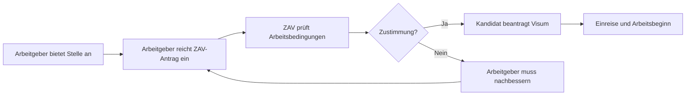
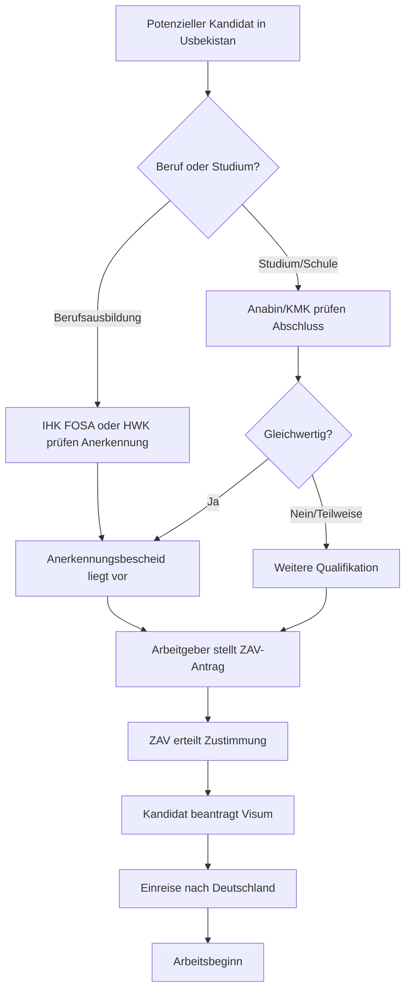

# Anabin, ZAV, KMK und die Berufsanerkennung – Zusammenspiel erklärt

## Warum dieser Artikel?

In vielen Informationsseiten werden **Anabin, ZAV, KMK, IHK FOSA und HWK** separat behandelt. Für die Praxis ist aber entscheidend, wie diese Systeme zusammenspielen. Dieser Artikel zeigt, welche Stelle für welchen Nachweis zuständig ist und in welcher Reihenfolge die Verfahren ablaufen.

!!! info "Politische Grundlage: Deutsch-Usbekisches Migrationsabkommen (2024)"
    Am **15. September 2024** unterzeichneten Bundeskanzler Olaf Scholz und Präsident Shavkat Mirziyoyev in Samarkand ein **Migrationsabkommen (Mobilitätspartnerschaft)** zwischen Deutschland und Usbekistan. Das Abkommen erleichtert die Einwanderung qualifizierter usbekischer Fachkräfte nach Deutschland und ist die strategische Grundlage für die Arbeit von AATRIUM. Quelle: bundesregierung.de – Pressestatement des Kanzlers in Samarkand, 15.09.2024: https://www.bundesregierung.de/breg-de/service/archiv-bundesregierung/kanzler-statement-usbekistan-2308514 (live verifiziert, Juli 2026).

---

## Die vier Säulen auf einen Blick

| System | Was wird geprüft? | Relevant für |
|--------|-------------------|--------------|
| **Anabin** | Gleichwertigkeit ausländischer **Hochschulabschlüsse** und Schulabschlüsse | Akademiker, Ingenieure, Techniker mit Studium |
| **KMK** | Anerkennung ausländischer **Schulabschlüsse** für Hochschulzugang | Personen mit weiterführenden Schulabschlüssen |
| **IHK FOSA / HWK** | Anerkennung ausländischer **Berufsabschlüsse** | Fachkräfte mit Ausbildung (Hauptzielgruppe von AATRIUM) |
| **ZAV** | Zustimmung der Bundesagentur für Arbeit zur **Beschäftigung** eines ausländischen Arbeitnehmers | Alle ausländischen Fachkräfte vor Arbeitsbeginn |

!!! info "Kernbotschaft"
    **Anabin/KMK** prüfen **Schul- und Studienabschlüsse**. **IHK FOSA/HWK** prüfen **Berufsausbildungen**. **ZAV** prüft die **Arbeitsmarktzulassung**. Diese Verfahren laufen parallel oder nacheinander, nicht gegeneinander.

---

## 1. Anabin – Datenbank für ausländische Bildungsabschlüsse

### Was ist Anabin?

**Anabin** ist eine Online-Datenbank der Kultusministerkonferenz (KMK). Sie gibt Auskunft darüber, wie ausländische **Schul- und Hochschulabschlüsse** in Deutschland bewertet werden.

- Website: https://anabin.kmk.org (live verifiziert)
- Betreiber: Kultusministerkonferenz (KMK)
- Zielgruppe: Akademiker, Studienbewerber, Arbeitgeber, Behörden

### Die drei Bewertungsstufen (Hochschulabschlüsse)

| Stufe | Bedeutung | Konsequenz |
|-------|-----------|------------|
| **H+** | Abschluss wird als gleichwertig anerkannt | Kann direkt für Beruf oder Studium genutzt werden |
| **H-** | Abschluss wird nicht als gleichwertig anerkannt | Weitere Qualifikation oder Anerkennungsverfahren nötig |
| **H+/-** | Einzelfallprüfung durch zuständige Stelle | Anerkennung hängt von Einzelumständen ab |

### Wann ist Anabin relevant?

| Szenario | Relevanz |
|----------|----------|
| Usbekischer Ingenieur mit Hochschulabschluss | Sehr relevant – Anabin prüft Gleichwertigkeit des Studiums |
| Usbekischer Maurer mit Lehre | Nicht relevant für die Berufsanerkennung (dafür HWK) |
| Usbekischer Techniker mit Fachschulabschluss | Teilweise relevant – kann Hinweise geben, ersetzt aber nicht die Berufsanerkennung |
| Person will in Deutschland studieren | Relevant für Hochschulzugang |

!!! warning "Wichtig"
    Anabin ersetzt **keine** offizielle Anerkennung. Es ist eine Orientierungshilfe. Für rechtsverbindliche Entscheidungen ist die zuständige Anerkennungsstelle zuständig.

### Beispiel aus der Live-Recherche (Juli 2026)

Auf Anabin (https://anabin.kmk.org) finden sich für **Usbekistan** tatsächlich im System vorhandene Hochschulabschlüsse. Die Live-Recherche (Juli 2026) ergab konkrete Einträge, die für AATRIUM relevant sind:

### Beispiele für Bachelor (bakalavr)

| Usbekischer Abschluss | Deutscher Vergleich | Klasse | Studienrichtung |
|---|---|---|---|
| `bakalavr (bino va inshootlar qurilishi)` | Bachelor (Bauwesen und Baukonstruktionen) | **A4** | Bauwesen und Baukonstruktionen |
| `akparattyk-kommunikacijalyk technologijalar salasynyn bakalavry (bagdarlamalyk inzenerija)` | Bachelor im Bereich Informations- und Kommunikationstechnologien (Softwaretechnik) | **A4** | Softwaretechnik / Software Engineering |
| `akparattyk-kommunikacijalyk technologijalar salasynyn bakalavry (telekommunikacijalyk züjeler)` | Bachelor im Bereich Informations- und Kommunikationstechnologien (Telekommunikationssysteme) | **A4** | Telekommunikationssysteme |
| `ajyl carbasynyn bakalavry (agroekonomika)` | Bachelor der Landwirtschaft (Agrarökonomie) | **A4** | Agrarökonomie |
| `architektor-dyzajner (architektura)` | Architekt-Designer (Architektur) | **A4** | Architektur |

### Beispiele für Master (magistr)

| Usbekischer Abschluss | Deutscher Vergleich | Klasse | Studienrichtung |
|---|---|---|---|
| `magistr (elektr energeticarsi tizim va tarmoqlar)` | Master (Elektrische Energienetze und -systeme) | **A5** | Elektrische Energienetze und -systeme |
| `magistr (kopriklar va transport tonnellaridan foydalanish)` | Master (Instandhaltung von Brücken und Verkehrstunneln) | **A5** | Instandhaltung von Brücken und Verkehrstunneln |
| `magistr (neft va gaz quduqlarini burgulash)` | Master (Erdöl- und Erdgasbohrungen) | **A5** | Erdöl- und Erdgasbohrungen |
| `magistr (suv taminati, suv oqizish)` | Magister (Wasserversorgung und -netze) | **A5** | Wasserversorgung und -netze |
| `Biznes boshqaruvi magistri (biznes boshqaruvi)` | Master für Betriebswirtschaft (Betriebswirtschaft) | **A5** | Betriebswirtschaft |

### Was bedeutet die Klasse?

| Klasse | Bedeutung |
|---|---|
| **A4** | Bachelor vergleichbar |
| **A5** | Master vergleichbar |
| **A6** | Promotion vergleichbar |

!!! note "Was bedeutet das in der Praxis?"
    Ein usbekischer Kandidat mit **Bakalavr in Bino va inshootlar qurilishi** (Bauwesen und Baukonstruktionen) wird in Anabin als **Klasse A4** geführt. Das ist ein konkreter Hinweis auf die Gleichwertigkeit mit einem deutschen Bachelor. Ob er für eine konkrete deutsche Position als Bauingenieur anerkannt wird, hängt aber von der **IHK FOSA** (für Ingenieure) oder der **zuständigen Kammer** ab, nicht von Anabin allein.

### Anleitung: Anabin für ein usbekisches Studium prüfen

1. Rufe https://anabin.kmk.org auf.
2. Klicke auf **„Hochschulabschlüsse“** (oder „Schulabschlüsse“ für Schulzeugnisse).
3. Wähle im Feld **„Länder“** die Option **Usbekistan**.
4. Optional: Wähle einen **Abschlusstyp** (z. B. `bakalavr`, `magistr`, `mutaxassis`).
5. Optional: Wähle eine **Studienrichtung** (z. B. `bino va inshootlar qurilishi` für Bauingenieurwesen).
6. Klicke auf **„Suche starten“**.
7. Prüfe das Ergebnis: **H+**, **H-** oder **H+/-**.

!!! tip "Für Nicht-Deutschleser"
    Die Anabin-Datenbank zeigt die usbekischen Studiengänge oft in der Originalsprache (kyrillisch oder lateinisch transliteriert). Suche am besten mit dem originalen usbekischen Begriff, z. B. `bino va inshootlar qurilishi` statt „Bauingenieurwesen“.

---

## 2. Anabin-Einträge für konkrete Max-Bögl-Berufe (Juli 2026)

Die folgenden Zuordnungen basieren auf der Stellenprofile-PDF der Max-Bögl-Firmengruppe (`Alle Stellen Bögl.pdf`, 21 Seiten, 11 Profile) und einer Live-Recherche in Anabin. Sie zeigen, welche usbekischen **Hochschulabschlüsse** für typische Bögl-Berufe in Anabin gefunden wurden. Die meisten Max-Bögl-Positionen sind jedoch **Facharbeiterstellen**, für die Anabin nur bedingt relevant ist – die eigentliche Berufsanerkennung erfolgt über IHK FOSA/HWK. Diese Liste ist keine Garantie für Anerkennung, liefert aber eine konkrete Orientierung für Recruiter.

| # | Max-Bögl-Stelle | Referenzcode | Relevante Anforderung | Usbekischer Abschluss in Anabin | Deutscher Vergleich | Klasse | Anabin-relevant? |
|---|-----------------|--------------|----------------------|----------------------------------|---------------------|--------|------------------|
| 1 | Baufacharbeiter / Baumaschinist (Tiefbau) | `DE-50311082-0002-B` | Facharbeiter/Berufserfahrung, Baumaschinenführer | `bakalavr (avtomobil yo'llari, ko'priklar, tonnellar, yo'l o'tkazgichlar va aerodromlarni loyihalash va qurish)` | Bachelor (Planung und Bau von Autobahnen, Brücken, Tunneln, Straßenüberführungen und Flugplätzen) | **A4** | Nur bei Studium |
| 2 | Elektroniker für Geräte und Systeme | `DE-50438392-0002-A` | Elektroniker/Mechatroniker-Ausbildung | `bakalavr (avtomobilsozlik va traktorsozlik)` | Bachelor (Automobil- und Traktorenbau) | **A4** | Nur bei Studium |
| 3 | Elektroniker für Baustellenversorgung (Frankfurt/Stuttgart) | `DE-50456029-0002-A` | Elektroniker/Mechatroniker-Ausbildung | `bakalavr (avtomobilsozlik va traktorsozlik)` | Bachelor (Automobil- und Traktorenbau) | **A4** | Nur bei Studium |
| 4 | Kranfahrer (Mobil-/Raupen-/Turmdrehkran) | `DE-50493401-0002-A` | Facharbeiter, Kranführer | *kein passender usbekischer Anabin-Eintrag* | — | — | Nein |
| 5 | Kranmonteur | `DE-50455987-0002-A` | Schlosser, Maschinenschlosser, Kfz-/Landmaschinenmechatroniker | *kein passender usbekischer Anabin-Eintrag* | — | — | Nein |
| 6 | Tiefbaufacharbeiter / Rohrleger (Infrastruktur) | `DE-50472915-0002-A` | Facharbeiter/Berufserfahrung, Tiefbau/Rohrleger | `bakalavr (suv xo'jaligi va melioratsiya)` | Bachelor (Wasserwirtschaft und Melioration) | **A4** | Nur bei Studium |
| 7 | CNC-Anlagenbediener (Windenergie) | `DE-50439123-0002-A` | Zerspanungsmechaniker, CNC-Schleifer oder gleichwertig | *kein passender usbekischer Anabin-Eintrag* | — | — | Nein |
| 8 | Fachkraft für Lagerlogistik (Kommissionierung Windkraft) | `DE-50484766-0002-A` | Lagerlogistik/Fachkraft für Lagerlogistik | *kein passender usbekischer Anabin-Eintrag* | — | — | Nein |
| 9 | Industriemechaniker (Instandhaltung/Anlagenbau) | `DE-50483273-0002-A` | Industriemechaniker-Ausbildung oder gleichwertig | *kein passender usbekischer Anabin-Eintrag* | — | — | Nein |
| 10 | Maurer / Betonbauer / Zimmerer | `DE-50444256-0002-A` | Maurer/Betonbauer/Zimmerer oder gleichwertig | *kein passender usbekischer Anabin-Eintrag* | — | — | Nein |
| 11 | Schlosser / Monteur im Stahlbau | `DE-50489411-0002-A` | Facharbeiter, Montage/Stahlbau | *kein passender usbekischer Anabin-Eintrag* | — | — | Nein |

### Erklärung: „Nur bei Studium“ vs. „Nein“

| Kategorie | Bedeutung | Konsequenz für AATRIUM |
|-----------|-----------|------------------------|
| **Nur bei Studium** | Anabin listet einen passenden usbekischen Bachelor für diesen Fachbereich. Falls der Kandidat **tatsächlich ein Studium** hat, kann Anabin die akademische Einordnung liefern. Für die eigentliche Facharbeiterstelle ist aber trotzdem die **IHK FOSA/HWK** zuständig. | Recruiter sollten prüfen, ob der Kandidat ein Studium hat, aber dürfen Anabin nicht als Berufsanerkennung missverstehen. |
| **Nein** | Anabin listet **keinen** usbekischen Hochschulabschluss, der direkt auf diese Berufsausbildung passt. | Anabin ist hier komplett irrelevant. Die Anerkennung muss über IHK FOSA/HWK oder eine ZAV-Entscheidung auf Basis von Berufserfahrung erfolgen. |

!!! warning "Kernbotschaft"
    Für **9 von 11** Max-Bögl-Positionen ist Anabin **nicht die richtige Datenbank**, weil es sich um Facharbeiterausbildungen handelt. Die korrekte Anerkennungsstelle ist die **IHK FOSA** (Industrie/Technik) oder die **HWK** (Handwerk/Bau). Anabin ist nur für Kandidaten mit Hochschulabschluss relevant und selbst dann nur als ergänzende Orientierung.

!!! note "Weitere usbekische Anabin-Treffer (allgemein bau- und wassertechnisch)"
    Zusätzlich zu den oben genannten passenden Einträgen finden sich in Anabin für Usbekistan weitere Hochschulabschlüsse in verwandten Bereichen, die bei bestimmten Kandidatenprofilen nützlich sein können:

    | Usbekischer Abschluss | Deutscher Vergleich | Klasse | Anwendungskontext |
    |---|---|---|---|
    | `bakalavr (suv xo'jaligida menejment)` | Bachelor (Management in der Wasserwirtschaft) | **A4** | Wasserwirtschaft, Tiefbau |
    | `magistr (suv taminati, suv oqizish)` | Magister (Wasserversorgung und -netze) | **A5** | Tiefbau, Rohrleitungen |
    | `muhandis-kuruvic (suv tabminoti, kanalizacija, suv dojliklaridan...)` | Bauingenieur (Wasserversorgung, Kanalisation, Rationalisierung der Nutzung von Wasserressourcen) | **A5** | Tiefbau, Infrastruktur |
    | `bakalavr (bino va inshootlar qurilishi)` | Bachelor (Bauwesen und Baukonstruktionen) | **A4** | Allgemeiner Bauwesen-Bachelor |

!!! tip "Recherche-Tipp"
    In Anabin funktioniert die Suche nach Ländern über das Dropdown nur eingeschränkt. Gezielte Suchbegriffe in usbekischer Sprache liefern bessere Ergebnisse: `bino`, `inshoot`, `elektr`, `mexanika`, `mashinasozlik`, `energetika`, `transport`, `suv`, `avtomobil`, `yo'l`. Für reine Berufsausbildungen sollte aber nicht Anabin, sondern `Anerkennung in Deutschland` genutzt werden.

---

## 3. KMK – Kultusministerkonferenz

### Was ist die KMK?

Die **Kultusministerkonferenz (KMK)** ist die Vereinigung der Bildungsministerien der Bundesländer. Sie legt gemeinsame Standards für Schulen und Hochschulen fest. Die KMK betreibt Anabin und regelt die Anerkennung ausländischer Schulabschlüsse.

!!! warning "Hinweis zur Quellenlage"
    Eine aktuelle KMK-Seite zur Anerkennung ausländischer Abschlüsse ist verfügbar: https://www.kmk.org/kultusministerkonferenz/uebergreifende-themen/anerkennung-auslaendischer-abschluesse.html (live verifiziert, Juli 2026). Ältere Direktlinks (z. B. `/themen/berufliche-schulen-und-berufsbildung/anerkennung-auslaendischer-abschluesse`) waren nicht mehr erreichbar. Die KMK als Betreiberin von Anabin ist weiterhin zuständig.

### Was macht die KMK für AATRIUM?

| Bereich | Bedeutung |
|---------|-----------|
| **Schulabschlüsse** | Bewertung, ob ein usbekischer Schulabschluss einem deutschen Hauptschul-, Realschul- oder Abiturabschluss gleichwertig ist |
| **Hochschulzugang** | Festlegung, welcher ausländische Schulabschluss zum Studium in Deutschland berechtigt |
| **Anabin-Datenbank** | Bereitstellung der Bewertungen für ausländische Abschlüsse |

### Wann ist die KMK relevant?

| Szenario | Relevanz |
|----------|----------|
| Kandidat hat keinen Berufsabschluss, aber Schulabschluss | Relevant für die Einstufung der Bildung |
| Kandidat will später in Deutschland studieren | Relevant für Hochschulzugang |
| Kandidat hat Abitur und eine Berufsausbildung | Anabin/KMK für Abitur, HWK/IHK FOSA für Beruf |

---

## 4. Anerkennung in Deutschland & BQ-Portal – Weitere offizielle Quellen

Neben Anabin gibt es zwei weitere zentrale Informationsportale des Bundes zur Anerkennung ausländischer Qualifikationen:

### Anerkennung in Deutschland

- Website: https://www.anerkennung-in-deutschland.de (live verifiziert)
- Betreiber: Bundesministerium für Bildung und Forschung (BMBF) / Arbeitsgemeinschaft
- Ziel: Wegweiser für alle, die eine ausländische Qualifikation in Deutschland anerkennen lassen möchten
- Besonderheit: Bietet einen **Online-Assistenten**, der die zuständige Stelle für den jeweiligen Beruf und Wohnort findet.

!!! tip "Wann nutzt man Anerkennung in Deutschland?"
    Für Fachkräfte mit einer **usbekischen Berufsausbildung** (z. B. Maurer, Schweißer, Elektroniker) ist dieses Portal der bessere Einstieg als Anabin, weil es direkt zur **IHK FOSA** oder **HWK** weiterleitet.

### BQ-Portal (Berufsqualifikation)

- Website: https://www.bq-portal.de (live verifiziert)
- Betreiber: Bundesministerium für Wirtschaft und Energie (BMWK) / Bundesinstitut für Berufsbildung (BIBB)
- Ziel: Informationen über **Berufsqualifikationen aus aller Welt**, insbesondere aus Ländern, aus denen Deutschland Fachkräfte rekrutiert
- Besonderheit: Ländersteckbriefe und Berufsprofile helfen, das Ausbildungssystem des Herkunftslandes zu verstehen

!!! info "Usbekistan im BQ-Portal"
    Im Länder- und Berufsprofil-Filter von BQ-Portal ist **Usbekistan** als Land auswählbar (live verifiziert im Juli 2026). Das Portal bietet damit prinzipiell Informationen zu usbekischen Ausbildungen und Berufen.

### Usbekische Berufsausbildungssysteme im BQ-Portal

Das BQ-Portal-Länderprofil für Usbekistan (gültig seit 01.09.2020) beschreibt das formelle Ausbildungssystem. Für die Praxis bei AATRIUM sind folgende Abschlüsse und Nachweistypen relevant:

| Stufe | Institution | Dauer | Usbekischer Abschluss | Deutscher Gegenstück | Für AATRIUM relevant |
|---|---|---|---|---|---|
| Grundlegende Berufsbildung | Berufsschule / Professional college | 2 Jahre | `O’zbekiston Respublikasi Boshlangʻich professional taʼlim diplomi` (Diploma of primary professional education) | Einfache Berufsausbildung / Grundbildung | Ja, für Facharbeiterstellen |
| Mittlere Berufsbildung | College | bis 2 Jahre | `O’zbekiston Respublikasi oʻrta professional taʼlim diplomi` (Diploma of secondary professional education) | Mittlere Berufsausbildung | Ja, typische Facharbeiterqualifikation |
| Mittlere Fachschulbildung | Technikum | mind. 2 Jahre | `O’zbekiston Respublikasi oʻrta maxsus professional ta’lim diplomi` (Diploma of secondary specialized professional education) | Techniker / Fachschulabschluss | Ja, für höherqualifizierte Fachkräfte |
| Bachelor | Universität | 4 Jahre | `O’zbekiston Respublikasi BAKALAVR DIPLOMI` | Bachelor | Ja, für akademische/technische Stellen |
| Master | Universität | 2 Jahre | `O’zbekiston Respublikasi MAGISTR DIPLOMI` | Master | Ja, für Führungs-/Ingenieurstellen |

!!! warning "Wichtig: Die Dokumente heißen anders"
    In der usbekischen Praxis sind für die Anerkennung in Deutschland meist **nicht** die reinen Diplome entscheidend, sondern die **Arbeitsnachweise**:
    - **Arbeitsbuch** (Mehnat daftari / Трудовая книжка) – der wichtigste Nachweis für Berufserfahrung
    - **Arbeitsbescheinigungen** (Ish staji to‘g‘risida ma’lumotnoma / Свидетельство о стаже)
    - **Ausbildungszeugnis** oder **Diplom** des Berufskollegs/Technikums
    - Für sowjetische Abschlüsse: **Svidetelstvo** (Свидетельство) oder **Attestat** mit Qualifikationskategorie (Razrjad)

### Berufsprofile im BQ-Portal für Max-Bögl-Berufe

Das BQ-Portal listet für Usbekistan konkrete Berufsprofile, die für die Max-Bögl-Positionen relevant sind. Die folgende Tabelle zeigt die Zuordnung:

| Max-Bögl-Stelle | BQ-Portal-Profil Usbekistan | Usbekischer/russischer Titel | Gültigkeitszeitraum | Hinweis |
|---|---|---|---|---|
| Elektroniker für Geräte und Systeme / Elektroniker für Baustellenversorgung | `Autoschlosser (Qualifikationskategorie 3/4/6)` | `Слесарь по ремонту автомобилей (3/4/6 разряд)` | 1969–1985 / Seit 1985 | Nächster verwandter Beruf; Elektroniker-Beruf nicht explizit gelistet |
| Kranmonteur / Schlosser / Monteur im Stahlbau | `Autoschlosser (Qualifikationskategorie 4/6)` | `Слесарь по ремонту автомобилей 4/6-го разряда` | 1969–1985 / Seit 1985 | Allgemeiner Schlosserbereich; Kran/Stahlbau nicht separat |
| Maurer / Betonbauer / Zimmerer | `Bautischler` / `Bautischler, Zimmerer (Parkettleger)` | `Столяр строительный`, `плотник` | 1986–2001 | Zimmerer/Bautischler, aber kein Maurer/Betonbauer |
| Baufacharbeiter / Baumaschinist | `Bautechniker/in` | `Quruvchi-texnik` | Seit 2021 | Techniker-Niveau, nicht reine Facharbeiterausbildung |
| (akademische Bau-/Wasserstellen) | `Bautechniker, Fr. Industrie- und Zivilbau` | `Техник-строитель` | 1982–1990 | Mittlere Fachschule |
| (akademische Bau-/Wasserstellen) | `Bautechniker-Technologe (Bau von Gebäuden und Anlagen)` | `Техник-строитель-технолог` | 1990–1997 | Mittlere Fachschule |

!!! warning "Fazit BQ-Portal-Recherche"
    Für die meisten reinen **Facharbeiterstellen** (Maurer, Betonbauer, Kranfahrer, CNC, Industriemechaniker, Elektroniker, Lagerlogistik) existieren im BQ-Portal **keine direkten usbekischen Berufsprofile**. Die nächsten verwandten Profile sind Autoschlosser und Bautischler. Das bedeutet: Die Anerkennung dieser usbekischen Facharbeiter in Deutschland erfordert in der Regel eine **individuelle Gleichwertigkeitsprüfung** durch IHK FOSA oder HWK auf Basis von Arbeitsbuch, Zeugnissen und ggf. Prüfung.

|| Portal | Wofür geeignet? | Für AATRIUM besonders wichtig bei |
|---|---|---|---|
|| Anabin | Hochschul- und Schulabschlüsse | Ingenieuren, Technikern mit Studium |
|| Anerkennung in Deutschland | Wegweiser zur richtigen Anerkennungsstelle | Allen Fachkräften mit Berufsausbildung |
|| BQ-Portal | Informationen über ausländische Ausbildungssysteme und konkrete Berufsprofile | Vorbereitung von Bewerbungsgesprächen, Plausibilisierung von Kandidatenprofilen, Erwartungsmanagement bei fehlenden direkten Berufsprofilen |

---

## 5. IHK FOSA / HWK – Anerkennung der Berufsausbildung

Diese Stellen wurden bereits in Artikel 18 detailliert erklärt. Hier die Einordnung im Gesamtablauf mit den **Rechtsgrundlagen**:

|| Berufsfeld | Zuständige Stelle | Rechtsgrundlage |
||------------|-------------------|-----------------|
|| Handwerk (Maurer, Zimmerer, Metallbauer, etc.) | Handwerkskammer (HWK) | § 41b HwO |
|| Industrie/Technik (Elektroniker, Industriemechaniker, CNC) | IHK FOSA | § 50 BBiG |
|| Kaufmännische Berufe | IHK FOSA | § 50 BBiG |

!!! warning "Wichtig: § 41b HwO seit 2025"
    Seit dem 1. Januar 2025 gilt § 41b HwO für die Feststellung der individuellen beruflichen Handlungsfähigkeit in Handwerksberufen. Das bedeutet: Auch ohne klassische deutsche Gesellenprüfung kann die HWK die Gleichwertigkeit einer usbekischen Ausbildung feststellen, wenn die individuelle berufliche Handlungsfähigkeit überwiegend oder vollständig vergleichbar ist.

!!! tip "IHK FOSA-Antragswege"
    Die IHK FOSA bietet drei Antragswege (live verifiziert, Juli 2026):
    - **Standardverfahren**: Im Inland und Ausland lebende Fachkräfte (4–12 Wochen)
    - **Beschleunigtes Verfahren**: Nur Arbeitgeber bei Ausländerbehörde am Firmensitz
    - **Folgeantrag**: Nach Erstbescheid und Anpassungsqualifizierung

!!! tip "Digitale Antragstellung"
    Die digitale Antragstellung erfolgt über **Anerkennung in Deutschland**: https://www.anerkennung-in-deutschland.de/de/interest/finder/profession

!!! tip "Verknüpfung"
    Die Berufsanerkennung ist für AATRIUM meist der **wichtigste Schritt**, weil die Kandidaten Facharbeiter sind. Sie muss **vor** oder **parallel** zum ZAV-Verfahren erfolgen.

!!! warning "Hinweis zur IHK FOSA"
    Die IHK FOSA-Website ist unter https://www.ihk-fosa.de erreichbar. Die Unterlagen wurden live verifiziert (Juli 2026):
    - Antragsformular (PDF): https://www.ihk-fosa.de/fileadmin/Dateien/Antragsformular/IHK_FOSA_Antrag_S.pdf
    - Vollmacht Einzelpersonen: https://www.ihk-fosa.de/fileadmin/Dateien/Antragsformular/Vollmacht_allgemein.pdf
    - Vollmacht Arbeitgeber: https://www.ihk-fosa.de/fileadmin/Dateien/Antragsformular/Vollmacht_Arbeitgeber.pdf
    - Standardverfahren: https://www.ihk-fosa.de/antragstellung/standard-verfahren/

---

## 6. ZAV – Zentrale Auslands- und Fachvermittlung

### Was ist die ZAV?

Die **ZAV** (Zentrale Auslands- und Fachvermittlung) ist eine Abteilung der **Bundesagentur für Arbeit**. Sie prüft, ob die **Beschäftigung eines ausländischen Arbeitnehmers** in Deutschland zugelassen wird.

- Zuständig für: Arbeitserlaubnis/Arbeitsplatzprüfung vor Visumerteilung
- Wichtig für: Nicht-EU-Bürger, die in Deutschland arbeiten wollen
- Aktuelle Links (Juli 2026 live verifiziert):
  - **ZAV-Startseite**: https://www.arbeitsagentur.de/vor-ort/zav/startseite
  - **ZAV – Über uns**: https://www.arbeitsagentur.de/vor-ort/zav/ueber-uns
  - **Regionale Zuständigkeiten (PDF)**: https://www.arbeitsagentur.de/datei/regionale-zustaendigkeiten-der-zav-im-bereich-arbeitsmarktzulassung_ba048053.pdf
- Kontakt: zav@arbeitsagentur.de, Tel. +49 228 713 1313

!!! warning "Hinweis zur Quellenlage"
    Ältere Direktlinks zur ZAV (z. B. `/zav`, `/zustimmung-beschaeftigung`, `/arbeitsmarkt-beruf/fachkraefte-ankommen/zav`) waren im Juli 2026 nicht mehr erreichbar (404). Die Bundesagentur für Arbeit hat ihre URL-Struktur umgebaut. Die oben genannten aktuellen Links funktionieren.

!!! info "Weitere Orientierung bei ZAV-Fragen"
    - **Auswärtiges Amt**: Visum- und Einreisefragen (https://www.auswaertiges-amt.de)
    - **Deutsche Botschaft Taschkent**: Zuständig für Visausbürgerung in Usbekistan
    - **Arbeitgeber**: Reicht den ZAV-Antrag über die örtliche Agentur für Arbeit oder direkt bei der ZAV ein
    - **Rechtsanwälte / Fachkräfteeinwanderungsberater**: Für komplexe Fälle

### Wann muss die ZAV eingeschaltet werden?

Die ZAV ist notwendig, wenn ein Arbeitgeber einen ausländischen Arbeitnehmer aus einem **Nicht-EU-Land** beschäftigen will. Usbekistan ist kein EU-Land, daher ist die ZAV für AATRIUM-Kandidaten immer relevant.

### Ablauf der ZAV-Zustimmung

### Was prüft die ZAV?

| Kriterium | Prüfung |
|-----------|---------|
| **Arbeitsvertrag** | Entspricht er deutschen Mindeststandards? |
| **Qualifikation** | Ist der Kandidat für die Stelle qualifiziert? |
| **Arbeitsmarkt** | Gibt es bevorrechtigte deutsche/europäische Bewerber? (bei Fachkräften meist keine Sperre) |
| **Arbeitsbedingungen** | Entsprechen sie dem Tarif oder ortsüblichen Vergleich? |

### Voraussetzung für ZAV

| Szenario | Benötigte Nachweise |
|----------|---------------------|
| Fachkraft mit anerkanntem Abschluss | Anerkennungsbescheid der IHK FOSA/HWK |
| Fachkraft mit qualifizierter Berufserfahrung | Arbeitsbuch, Arbeitszeugnisse, ggf. Anerkennung |
| Akademiker | Anabin-Auswertung oder Anerkennung des Studiums |

---

## Gesamtablauf: Von der Bewerbung bis zum Arbeitsbeginn

---

## Praktische Beispiele für Max Bögl

### Beispiel 1: Maurer aus Usbekistan für Sengenthal

| Schritt | Stelle | Ergebnis |
|---------|--------|----------|
| 1 | HWK für die Oberpfalz | Prüfung der Ausbildung als Maurer |
| 2 | HWK erteilt Anerkennung | Bescheid: Gleichwertig |
| 3 | Max Bögl beantragt ZAV-Zustimmung | Arbeitgeber reicht Unterlagen ein |
| 4 | ZAV stimmt zu | Kandidat darf beschäftigt werden |
| 5 | Kandidat beantragt Visum | Visum nach § 18 AufenthG |

### Beispiel 2: Industriemechaniker aus Usbekistan für Neumarkt

| Schritt | Stelle | Ergebnis |
|---------|--------|----------|
| 1 | IHK FOSA | Prüfung der Ausbildung |
| 2 | IHK FOSA erteilt Anerkennung | Bescheid: Gleichwertig |
| 3 | Max Bögl beantragt ZAV-Zustimmung | Arbeitgeber reicht Unterlagen ein |
| 4 | ZAV stimmt zu | Kandidat darf beschäftigt werden |
| 5 | Kandidat beantragt Visum | Visum nach § 18 AufenthG |

### Beispiel 3: Ingenieur aus Usbekistan für Max Bögl (akademische Stelle)

| Schritt | Stelle | Ergebnis |
|---------|--------|----------|
| 1 | Anabin | Prüfung des Hochschulabschlusses |
| 2 | Anabin zeigt H+ oder H+/- | Orientierung zur Gleichwertigkeit |
| 3 | Ggf. Anerkennung durch KMK/zuständige Stelle | Rechtsverbindlicher Bescheid |
| 4 | Max Bögl beantragt ZAV-Zustimmung | Arbeitgeber reicht Unterlagen ein |
| 5 | ZAV stimmt zu | Kandidat darf beschäftigt werden |

---

## Häufige Missverständnisse vermeiden

| Missverständnis | Richtigstellung |
|-----------------|-----------------|
| „Anabin reicht für die Anerkennung.“ | Anabin ist nur eine Orientierung. Rechtsverbindlich ist die Entscheidung der IHK FOSA/HWK/zuständigen Stelle. |
| „Die KMK erkennt Berufsausbildungen an.“ | Die KMK erkennt Schul- und Hochschulabschlüsse an, nicht Berufsausbildungen. |
| „Mit Anerkennung kann der Kandidat sofort arbeiten.“ | Die Anerkennung allein reicht nicht. Die ZAV-Zustimmung und das Visum sind zusätzlich nötig. |
| „ZAV ist für Fachkräfte nicht nötig.“ | Für Nicht-EU-Bürger wie Usbeken ist die ZAV grundsätzlich erforderlich. |
| „Anabin ist für Maurer wichtig.“ | Für Maurer ist die HWK zuständig, nicht Anabin. |

---

## Zusammenfassung: Wer macht was?

| Frage | Antwort | Zuständige Stelle |
|-------|---------|-------------------|
| Ist mein usbekisches Studium gleichwertig? | Anabin/KMK prüfen Hochschulabschlüsse | Anabin / KMK |
| Ist meine usbekische Ausbildung gleichwertig? | IHK FOSA (Industrie) oder HWK (Handwerk) prüfen | IHK FOSA / HWK |
| Darf ich einen Usbeken in Deutschland beschäftigen? | ZAV prüft und stimmt zu | ZAV (Bundesagentur für Arbeit) |
| Was brauche ich für das Visum? | Anerkennungsbescheid + ZAV-Zustimmung + Arbeitsvertrag | Auswärtiges Amt / Botschaft |

---

## Checkliste: Alle Systeme im Blick

### Checkliste für Kandidaten mit Berufsausbildung

- [ ] Ausbildung der IHK FOSA oder HWK zur Anerkennung vorlegen
- [ ] Bescheid über Gleichwertigkeit einholen
- [ ] Arbeitgeber reicht ZAV-Antrag ein
- [ ] Nach ZAV-Zustimmung: Visum beantragen

### Checkliste für Kandidaten mit Hochschulabschluss

- [ ] Abschluss in Anabin prüfen
- [ ] Ggf. offizielle Anerkennung des Studiums beantragen
- [ ] Arbeitgeber reicht ZAV-Antrag ein
- [ ] Nach ZAV-Zustimmung: Visum beantragen

### Checkliste für Kandidaten mit Schulabschluss, aber ohne Berufsausbildung

- [ ] Schulabschluss in Anabin/KMK prüfen
- [ ] Ggf. Ausbildungsnachweis oder Qualifizierung
- [ ] Für unqualifizierte Arbeit: Arbeitsvisum nur bei Vorrangprüfung schwierig

---

## Praxis-Checkliste für AATRIUM-Recruiter (Patrick / Team)

Bevor ein Kandidat an Max Bögl oder einen anderen Arbeitgeber weitergeleitet wird, sollten folgende Punkte geprüft werden:

| Nr. | Prüfung | Wo nachschauen? | Was ist das Ziel? |
|-----|---------|-----------------|-------------------|
| 1 | Hat der Kandidat einen **Berufsabschluss**? | Arbeitsbuch, Arbeitsbescheinigung, Anketa, Zeugnisse | Klären, ob IHK FOSA oder HWK zuständig ist |
| 2 | Hat der Kandidat ein **Studium**? | Diplom, Zeugnisse, Anabin | Anabin-Suche nach Stufe H+/H-/H+/- |
| 3 | Ist der Beruf auf dem deutschen **Ausbildungsberufe-Index**? | Anerkennung in Deutschland / IHK FOSA / HWK | Einschätzung der Anerkennungswahrscheinlichkeit |
| 4 | Gibt es **Berufserfahrung** statt Ausbildung? | Arbeitsbuch, Arbeitsbescheinigungen | ZAV kann bei ausreichender Erfahrung auch ohne Anerkennung zustimmen |
| 5 | Ist der Arbeitgeber bereit, **ZAV-Antrag** zu stellen? | Gespräch mit Arbeitgeber | Ohne Arbeitgeber keine ZAV-Zustimmung |
| 6 | Passen **Arbeitsvertrag** und **Qualifikation** zusammen? | ZAV prüft dies | Verhindert Ablehnung wegen unzureichender Qualifikation |

!!! tip "Dokumenten-Check vor Weiterleitung"
    Bevor ein Kandidat weitergeleitet wird, sollten immer vorliegen: **Arbeitsbuch / Arbeitsbescheinigung**, **Ausbildungszeugnis oder Studiennachweis**, **Passkopie**, **ggf. Anabin- oder Anerkennungsausdruck**.

---

## Quellen und Stand der Recherche

- **Anabin**: https://anabin.kmk.org (live verifiziert, Juli 2026)
- **Max-Bögl-Stellenprofile PDF**: `"Alle Stellen Bögl.pdf"` (21 Seiten, 11 Profile; ausgewertet für die Berufs-Tabelle)
- **Anerkennung in Deutschland**: https://www.anerkennung-in-deutschland.de (live verifiziert, Juli 2026)
- **BQ-Portal**: https://www.bq-portal.de (live verifiziert, Usbekistan im Länderfilter vorhanden, Juli 2026)
- **IHK FOSA**: https://www.ihk-fosa.de (live verifiziert, Juli 2026)
  - Standardverfahren: https://www.ihk-fosa.de/antragstellung/standard-verfahren/
  - Antragsformular (PDF): https://www.ihk-fosa.de/fileadmin/Dateien/Antragsformular/IHK_FOSA_Antrag_S.pdf
  - Vollmacht Einzelpersonen: https://www.ihk-fosa.de/fileadmin/Dateien/Antragsformular/Vollmacht_allgemein.pdf
  - Vollmacht Arbeitgeber: https://www.ihk-fosa.de/fileadmin/Dateien/Antragsformular/Vollmacht_Arbeitgeber.pdf
  - Digitale Antragstellung: https://www.anerkennung-in-deutschland.de/de/interest/finder/profession
- **KMK – Anerkennung ausländischer Qualifikationen**: https://www.kmk.org/kultusministerkonferenz/uebergreifende-themen/anerkennung-auslaendischer-abschluesse.html (live verifiziert, Juli 2026)
- **ZAV – Bundesagentur für Arbeit**: https://www.arbeitsagentur.de/vor-ort/zav/startseite (live verifiziert, Juli 2026)
  - Über uns: https://www.arbeitsagentur.de/vor-ort/zav/ueber-uns
  - Regionale Zuständigkeiten (PDF): https://www.arbeitsagentur.de/datei/regionale-zustaendigkeiten-der-zav-im-bereich-arbeitsmarktzulassung_ba048053.pdf
  - Kontakt: zav@arbeitsagentur.de, Tel. +49 228 713 1313
- **BMAS – Fachkräfteeinwanderungsgesetz**: https://www.bmas.de/DE/Arbeit/Migration-und-Arbeit/Rechtliches-zu-Einreise-Arbeitsmarktzugang-und-Absicherung/Fachkraefteeinwanderungsgesetz/fachkraefteeinwanderungsgesetz.html (live verifiziert, Juli 2026)
- **BAMF – Fachkräfte mit Berufsausbildung**: https://www.bamf.de/DE/Themen/MigrationAufenthalt/ZuwandererDrittstaaten/Arbeit/Fachkraft/fachkraft-node.html (live verifiziert, Juli 2026)
- **BMWK – „Möglichkeiten der Fachkräfteeinwanderung" (PDF)**: https://www.bundeswirtschaftsministerium.de/Redaktion/DE/Publikationen/Ausbildung-und-Beruf/moeglichkeiten-der-fachkraefteeinwanderung.pdf
- **BMWK – „Beschleunigtes Fachkräfteverfahren" (PDF)**: https://www.bundeswirtschaftsministerium.de/Redaktion/DE/Publikationen/Ausbildung-und-Beruf/beschleunigtes-fachkraefteverfahren.pdf
- **Bundesagentur für Arbeit – „Das Fachkräfteeinwanderungsgesetz" (PDF)**: https://www.arbeitsagentur.de/datei/dam-fachkraefte-einwanderungsgesetz_ba030375.pdf
- **Auswärtiges Amt**: https://www.auswaertiges-amt.de (für Visum- und Einreisefragen)
- **Übersetzerdatenbank**: https://www.justiz-dolmetscher.de/Recherche/ (für beeidigte Dolmetscher)
- **Gesetze**:
  - AufenthG § 18, § 18a, § 18b: https://www.gesetze-im-internet.de/aufenthg_2004/
  - BBiG § 50: https://www.gesetze-im-internet.de/bbig_2005/__50.html
  - HwO § 41b: https://www.gesetze-im-internet.de/hwo/__41b.html
  - HwO § 123a: https://www.gesetze-im-internet.de/hwo/__123a.html

!!! info "Hinweis zur Recherche"
    Dieser Artikel wurde auf Grundlage einer Live-Recherche im Juli 2026 erstellt. Viele Bundesbehörden-Websites haben ihre URL-Strukturen umgebaut. Die oben genannten Links wurden im Juli 2026 live verifiziert. Ältere Direktlinks, die nicht mehr funktionieren, wurden ersetzt. Die gesetzlichen Grundlagen (AufenthG, BBiG, HwO) wurden direkt von https://www.gesetze-im-internet.de verifiziert.
