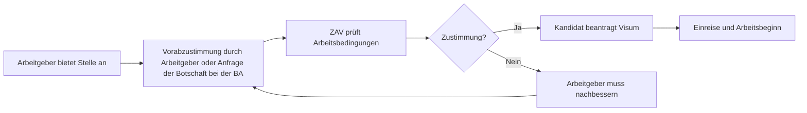
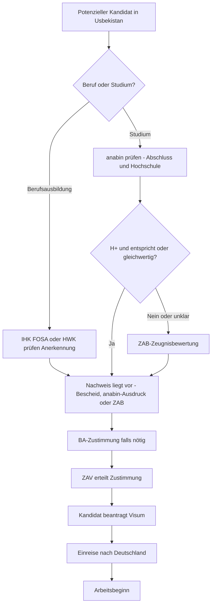

# Anabin, ZAV, KMK und die Berufsanerkennung – Zusammenspiel erklärt

**Stand:** 2026-10-04 (Satz für Satz an Primärquellen geprüft; Prüfprotokoll: Claude outputs/2026-10-04_Wiki_Pruefprotokoll.md)

## Warum dieser Artikel?

In vielen Informationsseiten werden **Anabin, ZAV, KMK, IHK FOSA und HWK** separat behandelt. Für die Praxis ist aber entscheidend, wie diese Systeme zusammenspielen. Dieser Artikel zeigt, welche Stelle für welchen Nachweis zuständig ist und in welcher Reihenfolge die Verfahren ablaufen.

Für AATRIUM gilt: Die Kandidaten sind meist Bauingenieure und -techniker mit **Hochschulabschluss**. Ihr Weg ist in der Regel § 18b AufenthG oder die Blaue Karte. Für sie zählen **anabin** und die **ZAB**. IHK FOSA und HWK betreffen nur Kandidaten mit Berufsausbildung (§ 18a AufenthG).

!!! info "Politische Grundlage: Deutsch-Usbekisches Migrationsabkommen (2024)"
    Am **15. September 2024** wurde in Samarkand das **Abkommen über eine umfassende Migrations- und Mobilitätspartnerschaft** zwischen Deutschland und Usbekistan unterzeichnet. Das geschah beim Besuch von Bundeskanzler Olaf Scholz bei Präsident Shavkat Mirziyoyev. Für Deutschland unterschrieb Bundesinnenministerin Nancy Faeser. Das Abkommen ist seit dem **5. März 2025** in Kraft. Es soll die Einwanderung qualifizierter usbekischer Fachkräfte erleichtern und ist die strategische Grundlage für die Arbeit von AATRIUM. Quellen: BGBl. 2025 II Nr. 238: https://www.recht.bund.de/bgbl/2/2025/238/regelungstext.pdf?__blob=publicationFile&v=3 ; bundesregierung.de – Pressestatement des Kanzlers in Samarkand, 15.09.2024: https://www.bundesregierung.de/breg-de/service/archiv-bundesregierung/kanzler-statement-usbekistan-2308514 (abgerufen 04.10.2026).

---

## Die vier Säulen auf einen Blick

| System | Was wird geprüft? | Relevant für |
|--------|-------------------|--------------|
| **Anabin** | Einstufung ausländischer **Hochschulabschlüsse**, Hochschulen und Schulabschlüsse (Datenbank der ZAB, keine Einzelentscheidung) | Akademiker, Ingenieure, Techniker mit Studium (Kernzielgruppe von AATRIUM) |
| **KMK / ZAB** | Die ZAB bei der KMK betreibt anabin und stellt **Zeugnisbewertungen** für ausländische Hochschulabschlüsse aus. Über **Schulabschlüsse** entscheiden die Zeugnisanerkennungsstellen der Länder, beim Studium die Hochschulen | Akademiker ohne passenden anabin-Eintrag; Personen mit Schulabschluss |
| **IHK FOSA / HWK** | Anerkennung ausländischer **Berufsabschlüsse** | Fachkräfte mit Berufsausbildung (§ 18a AufenthG) |
| **ZAV** | Zustimmung der Bundesagentur für Arbeit zur **Beschäftigung** eines ausländischen Arbeitnehmers | § 18a, § 18b, Blaue Karte mit abgesenkter Gehaltsschwelle, § 6 BeschV. Nicht nötig bei der Blauen Karte ab 50.700 € (2026) |

Quellen: KMK/ZAB, Anerkennung im Schulbereich: https://www.kmk.org/zab/zentralstelle-fuer-auslaendisches-bildungswesen/allgemeines-zur-anerkennung/anerkennung-im-schulbereich.html ; ZAB, Zeugnisbewertung: https://zab.kmk.org/de/zeugnisbewertung ; BA-Newsletter ISS 03/2026: https://www.arbeitsagentur.de/vor-ort/zav/working-and-living-in-germany/newsletter-iss/03-2026/blaue-karte (alle abgerufen 04.10.2026).

!!! info "Kernbotschaft"
    **anabin** zeigt, wie die ZAB ausländische **Hochschulabschlüsse und Hochschulen** einstuft. Passt der Eintrag nicht, bewertet die **ZAB** den Abschluss einzeln (Zeugnisbewertung). **IHK FOSA/HWK** prüfen **Berufsausbildungen**. Die **ZAV** (BA) prüft die **Arbeitsmarktzulassung**. Diese Verfahren laufen parallel oder nacheinander, nicht gegeneinander.

---

## 1. Anabin – Datenbank für ausländische Bildungsabschlüsse

### Was ist Anabin?

**Anabin** ist eine Online-Datenbank der Zentralstelle für ausländisches Bildungswesen (ZAB) bei der Kultusministerkonferenz (KMK). Sie gibt Auskunft darüber, wie ausländische **Schul- und Hochschulabschlüsse** und **Hochschulen** in Deutschland eingestuft werden.

- Website: https://anabin.kmk.org (abgerufen 04.10.2026)
- Betreiber: Kultusministerkonferenz – Zentralstelle für ausländisches Bildungswesen (ZAB)
- anabin ist eine **Fallsammlung**: Abschlüsse und Hochschulen kommen erst hinein, wenn die ZAB sie in einem Einzelfall bewertet hat. Die Datenbank ist nicht vollständig (Visumhandbuch, Kapitel „Anerkennung ausländischer Berufsqualifikationen“, Stand 06/2024: https://www.auswaertiges-amt.de/resource/blob/207816/5f5be4158ee61f51115a2a32e2885c67/visumhandbuch-data.pdf).
- Zielgruppe: Akademiker, Studienbewerber, Arbeitgeber, Behörden

### Die Bewertungen in anabin: Status der Hochschule und Äquivalenzklasse des Abschlusses

anabin bewertet zwei Dinge getrennt. **H+, H+/- und H-** beschreiben die **Hochschule**, nicht den Abschluss. Den **Abschluss** beschreibt die Äquivalenzklasse im Abschnitt „Bewertung“.

| Status der Hochschule | Bedeutung laut anabin | Konsequenz |
|-------|-----------|------------|
| **H+** | Im Herkunftsland maßgeblich als Hochschule anerkannt und in Deutschland als Hochschule anzusehen | Abschlüsse können geprüft werden. Über die Gleichwertigkeit sagt H+ allein noch nichts |
| **H-** | Vorläufig oder dauerhaft nicht als Hochschule anzusehen (z. B. ohne Akkreditierungsnachweis oder Fachschule) | Kein vergleichbarer Hochschulabschluss, auch wenn der Abschluss gut bewertet ist |
| **H+/-** | Für den Institutionstyp ist keine einheitliche Einstufung möglich | Nur vergleichbar, wenn der Abschluss bei genau dieser Hochschule als „entspricht“ oder „gleichwertig“ gelistet ist; sonst ZAB |

| Äquivalenzklasse des Abschlusses | Bedeutung laut anabin |
|---|---|
| **entspricht** | Dem deutschen Abschlusstyp formal gleichwertig. Zur materiellen Gleichwertigkeit keine Aussage |
| **gleichwertig** | Dem deutschen Abschlusstyp formal und materiell gleichwertig |
| **bedingt vergleichbar** | Dem deutschen Abschlusstyp formal, aber nicht materiell gleichwertig |

Was das für die Aufenthaltswege bedeutet (nicht reglementierte Berufe wie Bauingenieur):

| Ergebnis in anabin | § 18b AufenthG und Blaue Karte | § 19c Abs. 2 AufenthG mit § 6 BeschV |
|---|---|---|
| Hochschule **H+**, Abschluss **entspricht** oder **gleichwertig** | Vergleichbar. Zwei anabin-Ausdrucke (Abschluss und Hochschule) reichen, keine ZAB nötig. Der Abschluss muss nicht bei genau dieser Hochschule gelistet sein | Reicht als staatlich anerkannter Abschluss |
| Hochschule **H+**, Abschluss **bedingt vergleichbar** | Reicht nicht. ZAB-Zeugnisbewertung nötig | Reicht, keine ZAB nötig |
| Hochschule **H+/-** | Nur bei Listung des Abschlusses an dieser Hochschule mit „entspricht“ oder „gleichwertig“, sonst ZAB | Nicht ausdrücklich geregelt (nicht geprüft, Stand 04.10.2026). ZAB einplanen |
| Hochschule **H-**, oder Abschluss bzw. Hochschule nicht in anabin | ZAB-Zeugnisbewertung nötig | ZAB-Bestätigung nötig |

Liegt schon eine ZAB-Zeugnisbewertung vor, gilt diese vor dem anabin-Eintrag. Quellen: anabin, Erläuterungen „Status“ und „Äquivalenzklassen“ (https://anabin.kmk.org, abgerufen 04.10.2026); Visumhandbuch, Kapitel „Anerkennung ausländischer Berufsqualifikationen“, Stand 06/2024 (Gesamtausgabe 21.08.2026); BA, Fachliche Weisungen AufenthG/BeschV, 18.0.6 und 19c.6.3 (Stand 12/2024): https://www.arbeitsagentur.de/datei/dok_ba033210.pdf ; BA-Newsletter ISS 03/2026 (Blaue Karte) und ISS 04/2026: https://www.arbeitsagentur.de/vor-ort/zav/working-and-living-in-germany/newsletter-iss/04-2026/berufserfahrene ; Botschaft Taschkent, Fachkraft: https://taschkent.diplo.de/uz-de/service/05-visaeinreise/2446108-2446108 .

### Wann ist Anabin relevant?

| Szenario | Relevanz |
|----------|----------|
| Usbekischer Ingenieur mit Hochschulabschluss | Sehr relevant – anabin zeigt Status der Hochschule und Bewertung des Abschlusses (Grundlage für § 18b und Blaue Karte) |
| Usbekischer Maurer mit Lehre | Nicht relevant für die Berufsanerkennung (dafür HWK) |
| Usbekischer Techniker mit Technikum- oder Kollej-Diplom | Kaum relevant – anabin führt diese Diplome nur als Schulabschlüsse mit Hochschulzugang. Unter „Berufsabschlüsse“ stehen für Usbekistan nur vier Gesundheitsberufe (abgerufen 04.10.2026) |
| Person will in Deutschland studieren | Relevant für Hochschulzugang |

!!! warning "Wichtig"
    Die Einstufung in anabin ist **keine Anerkennungsentscheidung** (so anabin selbst). In **nicht reglementierten** Berufen (z. B. Arbeit als Bauingenieur) gibt es aber gar kein Anerkennungsverfahren. Botschaft, Ausländerbehörde und BA prüfen die Vergleichbarkeit über anabin, sonst über eine ZAB-Zeugnisbewertung. Nur in **reglementierten** Berufen braucht es eine Anerkennung durch die zuständige Stelle. Quellen: anabin, Erläuterung „Äquivalenzklassen“; Visumhandbuch, Kapitel „Anerkennung ausländischer Berufsqualifikationen“ (Stand 06/2024).

### Beispiele aus anabin (abgerufen 04.10.2026)

In anabin (https://anabin.kmk.org) stehen für **Usbekistan** über 300 Hochschulabschlüsse. Hier Beispiele, die für AATRIUM relevant sind. Alle Einträge unten haben die Äquivalenzklasse **„entspricht“** (deutscher Bachelor bzw. Master). Die Hochschule muss zusätzlich **H+** haben:

### Beispiele für Bachelor (bakalavr)

| Usbekischer Abschluss | Deutsche Übersetzung (anabin) | Klasse | Studienrichtung |
|---|---|---|---|
| `bakalavr (binolar va inshootlar qurilishi)` | Bachelor (Bau von Gebäuden und Bauwerken) | **A4** | Bau von Gebäuden und Bauwerken |
| `bakalavr (gidrotexnika qurilishi)` | Bachelor (Wasserbau) | **A4** | Wasserbau |
| `bakalavr (transport va gidrotexnika inshootlar qurilishi)` | Bachelor (Bau von Verkehrs- und wasserbaulichen Anlagen) | **A4** | Bau von Verkehrs- und wasserbaulichen Anlagen |
| `bakalavr (qurilish materiallari, buyumlari va konstruksiyalarini ishlab chiqarish)` | Bachelor (Herstellung von Baumaterialien, Produkten und Konstruktionen) | **A4** | Herstellung von Baumaterialien, Produkten und Konstruktionen |
| `bakalavr (muhandislik kommunikatsiyalari qurilishi va montaji [turlari bo'yicha])` | Bachelor (Bau und Montage von Ingenieurkommunikationssystemen [nach Typen]) | **A4** | Bau und Montage von Ingenieurkommunikationssystemen |

### Beispiele für Master (magistr)

| Usbekischer Abschluss | Deutsche Übersetzung (anabin) | Klasse | Studienrichtung |
|---|---|---|---|
| `magistr (elektr energetikasi tizimlari va tarmoqlari)` | Master (Elektrische Energiesysteme und Netze) | **A5** | Elektrische Energiesysteme und Netze |
| `magistr (ko'priklar va transport tonnellaridan foydalanish)` | Master (Betrieb von Brücken und Verkehrstunneln) | **A5** | Betrieb von Brücken und Verkehrstunneln |
| `magistr (neft va gaz quduqlarini burgulash)` | Master (Erdöl- und Erdgasbohrungen) | **A5** | Erdöl- und Erdgasbohrungen |
| `magistr (suv ta'minoti, suv oqizish)` | Master (Wasserversorgung, Abwasserentsorgung) | **A5** | Wasserversorgung, Abwasserentsorgung |
| `biznes boshqaruvi magistri (biznes boshqaruvi)` | Master in Betriebswirtschaft (Betriebswirtschaft) | **A5** | Betriebswirtschaft |

### Was bedeutet die Klasse?

| Klasse | Bedeutung laut anabin |
|---|---|
| **A4** | Abschlusstyp für Studiengänge mit einer typischen Normdauer von vier Jahren (Usbekistan: `bakalavr`) |
| **A5** | Abschlusstyp für Studiengänge mit einer typischen Normdauer von mehr als vier Jahren (Usbekistan: `magistr` und der alte Abschluss `mutaxassis`) |
| **D1** | Promotion (Usbekistan: `falsafa doktori` / früher `fanlari nomzodi`) |

!!! note "Was bedeutet das in der Praxis?"
    Die Klasse ist laut anabin **beschreibend, nicht bewertend**. Grundlage ist die typische Studiendauer. Sie ist **kein** Hinweis auf Gleichwertigkeit, und im Visumverfahren wird der Abschlusstyp gar nicht abgefragt. Entscheidend ist der Abschnitt **„Bewertung“** beim Abschluss. Beispiel: `bakalavr (binolar va inshootlar qurilishi)` hat dort die Äquivalenzklasse **„entspricht“** (deutscher Bachelor). Zusätzlich muss die Hochschule **H+** haben, z. B. die Toshkent arxitektura-qurilish universiteti (staatliche Hochschule, H+). Dann reicht für § 18b oder die Blaue Karte der anabin-Ausdruck. Eine Anerkennung durch IHK FOSA oder eine Kammer braucht ein Bauingenieur für die **Arbeit** nicht. Nur wer in Bayern den **Titel „Ingenieur“** führen will, braucht eine Genehmigung der Bayerischen Ingenieurekammer-Bau. Quellen: anabin, Erläuterung „Abschlussklassen“ und Einträge (abgerufen 04.10.2026); Visumhandbuch (Stand 06/2024); Regierung von Oberbayern, Berufsbezeichnung Ingenieur: https://www.regierung.oberbayern.bayern.de/aufgaben/leistung/leistung_27307/index.html (Stand 21.09.2026).

### Anleitung: Anabin für ein usbekisches Studium prüfen

1. Rufe https://anabin.kmk.org auf.
2. Wähle **„Hochschulabschlüsse“** und den Reiter **„Suchen nach Abschlüssen“** (für Schulzeugnisse: „Schulabschlüsse mit Hochschulzugang“).
3. Wähle im Feld **„Länder“** die Option **Usbekistan**.
4. Gib die Abschlussbezeichnung ins Freitextfeld ein (Umschrift wie `bakalavr` oder `binolar` geht). Optional: **Abschlusstyp** (z. B. `bakalavr`, `magistr`, `mutaxassis`) oder **Studienrichtung** wählen.
5. Öffne den passenden Eintrag und lies den Abschnitt **„Bewertung“**: entspricht, gleichwertig oder bedingt vergleichbar.
6. Wähle dann **„Institutionen“** → **„Suchen nach Institutionen“**, Land Usbekistan, Name der Hochschule. Lies im Eintrag den **„Status“**: **H+**, **H+/-** oder **H-**.
7. Sichere **beide Ergebnisse** mit Datum als PDF. Die Botschaft Taschkent verlangt zwei Ausdrucke: Abschluss und Hochschule.

Quellen: anabin, Rechercheanleitungen https://anabin.kmk.org/rechercheanleitung-hochschulabschluss und https://anabin.kmk.org/rechercheanleitung-hochschule (abgerufen 04.10.2026); Botschaft Taschkent, Fachkraft: https://taschkent.diplo.de/uz-de/service/05-visaeinreise/2446108-2446108 (abgerufen 03.10.2026).

!!! tip "Für Nicht-Deutschleser"
    Die Anabin-Datenbank zeigt die usbekischen Abschlüsse in der Originalsprache in lateinischer Schrift. Kyrillische Bezeichnungen sind umgeschrieben, ältere Einträge teils in alter Umschrift (z. B. `muhandis-kuruvci`). Suche am besten mit dem usbekischen Begriff, z. B. `binolar va inshootlar qurilishi` statt „Bauingenieurwesen“.

### Wenn anabin nicht reicht: ZAB-Zeugnisbewertung

Die **Zeugnisbewertung** der ZAB ist eine behördliche Bescheinigung. Sie stuft einen ausländischen Hochschulabschluss in das deutsche Bildungssystem ein. Sie berechtigt nicht zur Arbeit in einem reglementierten Beruf.

| Punkt | Stand 04.10.2026 |
|---|---|
| Wann nötig (§ 18b, Blaue Karte) | Abschluss „bedingt vergleichbar“, Hochschule H- oder H+/- ohne Listung des Abschlusses, Abschluss oder Hochschule nicht in anabin |
| Antrag | Online auf zab.kmk.org, Konto über BundID. Vorher kostenloser Vorab-Check, der die nötigen Dokumente nennt |
| Unterlagen | Scans als PDF. In der Regel genügt ein einfacher Scan ohne Beglaubigung oder Apostille. Usbekisches Diplom immer zusammen mit der **Ilova** scannen |
| Antrag für andere | Möglich mit Vollmacht, die der Abschlussinhaber persönlich unterschreibt |
| Gebühr | 208 € (erneute Ausfertigung 104 €). Zahlungsfrist regulär 3 Wochen |
| Dauer | 3 Monate regulär, 2 Monate im beschleunigten Fachkräfteverfahren. Blaue Karte: Ziel 2 Wochen, mit unterschriebenem Arbeitsvertrag oder Arbeitsplatzzusage. Die Bearbeitung beginnt erst, wenn alle Dokumente vorliegen und die Gebühr bezahlt ist |
| § 81a | ZSEF bzw. Ausländerbehörde prüft anabin und leitet die Zeugnisbewertung bei Bedarf selbst ein |

Quellen: ZAB, Zeugnisbewertung: https://zab.kmk.org/de/zeugnisbewertung ; Antrag: https://zab.kmk.org/de/zeugnisbewertung/antrag ; Gebühren: https://zab.kmk.org/de/zeugnisbewertung/gebuehren ; FAQ: https://zab.kmk.org/de/zeugnisbewertung/faq ; Blaue Karte EU: https://zab.kmk.org/de/blaue-karte-eu (abgerufen 03./04.10.2026); ZSEF, Checkliste akademische Ausbildung (Stand Februar 2026): https://www.regierung.mittelfranken.bayern.de/mam/aufgaben/sg16/checkliste_-_akademische_ausbildung.pdf

---

## 2. Anabin-Einträge für konkrete Max-Bögl-Berufe (Juli 2026)

Die folgenden Zuordnungen basieren auf der Stellenprofile-PDF der Max-Bögl-Firmengruppe (`Alle Stellen Bögl.pdf`, 21 Seiten, 11 Profile) und einer Recherche in anabin (Einträge am 04.10.2026 erneut geprüft). Sie zeigen, welche usbekischen **Hochschulabschlüsse** für typische Bögl-Berufe in Anabin gefunden wurden. Alle 11 Profile dieser PDF sind jedoch **Facharbeiterstellen**, für die Anabin nur bedingt relevant ist – die eigentliche Berufsanerkennung erfolgt über IHK FOSA/HWK. Diese Liste ist keine Garantie für Anerkennung, liefert aber eine konkrete Orientierung für Recruiter.

| # | Max-Bögl-Stelle | Referenzcode | Relevante Anforderung | Usbekischer Abschluss in Anabin | Deutsche Übersetzung (anabin) | Klasse | Anabin-relevant? |
|---|-----------------|--------------|----------------------|----------------------------------|---------------------|--------|------------------|
| 1 | Baufacharbeiter / Baumaschinist (Tiefbau) | `DE-50311082-0002-B` | Facharbeiter/Berufserfahrung, Baumaschinenführer | `bakalavr (avtomobil yo'llari, ko'priklar, tonnellar, yo'l o'tkazgichlar va aerodromlarni loyihalash va qurish [avtomobil yo'llari va aerodromlar bo'yicha])` | Bachelor (Planung und Bau von Autobahnen, Brücken, Tunneln, Straßenüberführungen und Flugplätzen [für Autobahnen und Flugplätze]) | **A4** | Nur bei Studium |
| 2 | Elektroniker für Geräte und Systeme | `DE-50438392-0002-A` | Elektroniker/Mechatroniker-Ausbildung | `bakalavr (avtomobilsozlik va traktorsozlik)` | Bachelor (Automobil- und Traktorenbau) | **A4** | Nur bei Studium |
| 3 | Elektroniker für Baustellenversorgung (Frankfurt/Stuttgart) | `DE-50456029-0002-A` | Elektroniker/Mechatroniker-Ausbildung | `bakalavr (avtomobilsozlik va traktorsozlik)` | Bachelor (Automobil- und Traktorenbau) | **A4** | Nur bei Studium |
| 4 | Kranfahrer (Mobil-/Raupen-/Turmdrehkran) | `DE-50493401-0002-A` | Facharbeiter, Kranführer | *kein passender usbekischer Anabin-Eintrag* | — | — | Nein |
| 5 | Kranmonteur | `DE-50455987-0002-A` | Schlosser, Maschinenschlosser, Kfz-/Landmaschinenmechatroniker | *kein passender usbekischer Anabin-Eintrag* | — | — | Nein |
| 6 | Tiefbaufacharbeiter / Rohrleger (Infrastruktur) | `DE-50472915-0002-A` | Facharbeiter/Berufserfahrung, Tiefbau/Rohrleger | `bakalavr (suv xo'jaligi va melioratsiya)` | Bachelor (Wasserwirtschaft und Melioration) | **A4** | Nur bei Studium |
| 7 | CNC-Anlagenbediener (Windenergie) | `DE-50439123-0002-A` | Zerspanungsmechaniker, CNC-Schleifer oder gleichwertig | *kein passender usbekischer Anabin-Eintrag* | — | — | Nein |
| 8 | Fachkraft für Lagerlogistik (Kommissionierung Windkraft) | `DE-50484766-0002-A` | Lagerlogistik/Fachkraft für Lagerlogistik | *kein passender usbekischer Anabin-Eintrag* | — | — | Nein |
| 9 | Industriemechaniker (Instandhaltung/Anlagenbau) | `DE-50483273-0002-A` | Industriemechaniker-Ausbildung oder gleichwertig | *kein passender usbekischer Anabin-Eintrag* | — | — | Nein |
| 10 | Maurer / Betonbauer / Zimmerer | `DE-50444256-0002-A` | Maurer/Betonbauer/Zimmerer oder gleichwertig | *kein passender usbekischer Anabin-Eintrag* | — | — | Nein |
| 11 | Schlosser / Monteur im Stahlbau | `DE-50489411-0002-A` | Facharbeiter, Montage/Stahlbau | *kein passender usbekischer Anabin-Eintrag* | — | — | Nein |

### Erklärung: „Nur bei Studium“ vs. „Nein“

| Kategorie | Bedeutung | Konsequenz für AATRIUM |
|-----------|-----------|------------------------|
| **Nur bei Studium** | Anabin listet einen passenden usbekischen Bachelor für diesen Fachbereich. Falls der Kandidat **tatsächlich ein Studium** hat, kann Anabin die akademische Einordnung liefern. Für die eigentliche Facharbeiterstelle ist aber trotzdem die **IHK FOSA/HWK** zuständig. | Recruiter sollten prüfen, ob der Kandidat ein Studium hat, aber dürfen Anabin nicht als Berufsanerkennung missverstehen. |
| **Nein** | Anabin listet **keinen** usbekischen Hochschulabschluss, der direkt auf diese Berufsausbildung passt. | Anabin ist hier komplett irrelevant. Der Weg führt über IHK FOSA/HWK (Gleichwertigkeitsbescheid, § 18a) oder über Berufserfahrung nach § 6 BeschV (BA-Zustimmung, keine deutsche Anerkennung nötig). |

!!! warning "Kernbotschaft"
    Für **alle 11** Max-Bögl-Positionen aus der PDF ist Anabin **nicht die richtige Datenbank** für die Berufsanerkennung, weil es sich um Facharbeiterausbildungen handelt. Bei 7 von 11 gibt es nicht einmal einen fachlich verwandten usbekischen Hochschulabschluss. Die korrekte Anerkennungsstelle ist die **IHK FOSA** (Industrie/Technik) oder die **HWK** (Handwerk/Bau). Anabin ist nur für Kandidaten mit Hochschulabschluss relevant. Für sie ist es aber der wichtigste Nachweis (§ 18b, Blaue Karte).

!!! note "Weitere usbekische Anabin-Treffer (allgemein bau- und wassertechnisch)"
    Zusätzlich zu den oben genannten passenden Einträgen finden sich in Anabin für Usbekistan weitere Hochschulabschlüsse in verwandten Bereichen, die bei bestimmten Kandidatenprofilen nützlich sein können:

    | Usbekischer Abschluss | Deutsche Übersetzung (anabin) | Klasse | Anwendungskontext |
    |---|---|---|---|
    | `bakalavr (suv xo'jaligida menejment)` | Bachelor (Management in der Wasserwirtschaft) | **A4** | Wasserwirtschaft, Tiefbau |
    | `magistr (suv ta'minoti, suv oqizish)` | Master (Wasserversorgung, Abwasserentsorgung) | **A5** | Tiefbau, Rohrleitungen |
    | `muhandis-kuruvic (suv tabminoti, kanalizacija, suv dojliklaridan...)` | Bauingenieur (Wasserversorgung, Kanalisation, Rationalisierung der Nutzung von Wasserressourcen und deren Messung); alter Abschlusstyp `mutaxassis` | **A5** | Tiefbau, Infrastruktur |
    | `bakalavr (binolar va inshootlar qurilishi)` | Bachelor (Bau von Gebäuden und Bauwerken) | **A4** | Allgemeiner Bauwesen-Bachelor |

!!! tip "Recherche-Tipp"
    Am besten das Land **Usbekistan** wählen und dazu gezielte Suchbegriffe in usbekischer Sprache eingeben: `bino`, `inshoot`, `elektr`, `mexanika`, `mashinasozlik`, `energetika`, `transport`, `suv`, `avtomobil`, `yo'l`. Für reine Berufsausbildungen sollte aber nicht Anabin, sondern `Anerkennung in Deutschland` genutzt werden.

---

## 3. KMK – Kultusministerkonferenz

### Was ist die KMK?

Die **Kultusministerkonferenz (KMK)** ist die Vereinigung der Bildungsministerien der Bundesländer. Sie legt gemeinsame Standards für Schulen und Hochschulen fest. Zur KMK gehört die **Zentralstelle für ausländisches Bildungswesen (ZAB)**, eine gemeinsame Einrichtung der Länder. Die ZAB betreibt anabin und stellt Zeugnisbewertungen aus. Über ausländische **Schulabschlüsse** entscheiden nicht KMK oder ZAB, sondern die Zeugnisanerkennungsstellen der Länder (für berufliche Zwecke) bzw. die Hochschulen (für die Zulassung zum Studium). Quellen: KMK, Anerkennung ausländischer Abschlüsse und Anerkennung im Schulbereich (abgerufen 04.10.2026).

!!! warning "Hinweis zur Quellenlage"
    Eine aktuelle KMK-Seite zur Anerkennung ausländischer Abschlüsse ist verfügbar: https://www.kmk.org/kultusministerkonferenz/uebergreifende-themen/anerkennung-auslaendischer-abschluesse.html (abgerufen 04.10.2026). Ältere Direktlinks (z. B. `/themen/berufliche-schulen-und-berufsbildung/anerkennung-auslaendischer-abschluesse`) waren nicht mehr erreichbar. anabin wird von der ZAB bei der KMK betrieben.

### Was macht die KMK für AATRIUM?

| Bereich | Bedeutung |
|---------|-----------|
| **Schulabschlüsse** | anabin zeigt die Einstufung. Ob ein usbekischer Schulabschluss einem deutschen Hauptschul-, Realschul- oder Abiturabschluss gleichsteht, entscheidet die Zeugnisanerkennungsstelle des Landes |
| **Hochschulzugang** | anabin enthält Bewertungsvorschläge (z. B. usbekisches 11-Klassen-Zeugnis: Studienkolleg bzw. Feststellungsprüfung; `bakalavr`: direkter Zugang). Über die Zulassung entscheidet die Hochschule |
| **Anabin-Datenbank** | Bereitstellung der Bewertungen für ausländische Abschlüsse und Hochschulen (durch die ZAB) |
| **ZAB-Zeugnisbewertung** | Einzelbewertung eines ausländischen Hochschulabschlusses, wenn anabin nicht reicht (siehe Abschnitt 1) |

### Wann ist die KMK relevant?

| Szenario | Relevanz |
|----------|----------|
| Kandidat hat keinen Berufsabschluss, aber Schulabschluss | Einstufung über die Zeugnisanerkennungsstelle des Landes (z. B. für eine Ausbildung in Deutschland) |
| Kandidat will später in Deutschland studieren | Relevant für Hochschulzugang |
| Kandidat hat Abitur und eine Berufsausbildung | Zeugnisanerkennungsstelle bzw. Hochschule für den Schulabschluss, HWK/IHK FOSA für den Beruf |

---

## 4. Anerkennung in Deutschland & BQ-Portal – Weitere offizielle Quellen

Neben Anabin gibt es zwei weitere zentrale Informationsportale des Bundes zur Anerkennung ausländischer Qualifikationen:

### Anerkennung in Deutschland

- Website: https://www.anerkennung-in-deutschland.de (abgerufen 04.10.2026)
- Betreiber: Bundesinstitut für Berufsbildung (BIBB) (Impressum: https://www.anerkennung-in-deutschland.de/html/de/impressum.php)
- Ziel: Wegweiser für alle, die eine ausländische Qualifikation in Deutschland anerkennen lassen möchten
- Besonderheit: Bietet den **Anerkennungs-Finder**, der die zuständige Stelle für den jeweiligen Beruf und Arbeitsort findet.

!!! tip "Wann nutzt man Anerkennung in Deutschland?"
    Für Fachkräfte mit einer **usbekischen Berufsausbildung** (z. B. Maurer, Schweißer, Elektroniker) ist dieses Portal der bessere Einstieg als Anabin, weil es direkt zur **IHK FOSA** oder **HWK** weiterleitet.

### BQ-Portal (Berufsqualifikation)

- Website: https://www.bq-portal.de (abgerufen 04.10.2026)
- Betreiber: Bundesministerium für Wirtschaft und Energie (BMWE); Umsetzung: Institut der deutschen Wirtschaft (IW) (Impressum: https://www.bq-portal.de/impressum)
- Ziel: Informationen über **Berufsqualifikationen aus aller Welt**, insbesondere aus Ländern, aus denen Deutschland Fachkräfte rekrutiert
- Besonderheit: Ländersteckbriefe und Berufsprofile helfen, das Ausbildungssystem des Herkunftslandes zu verstehen

!!! info "Usbekistan im BQ-Portal"
    Im Länder- und Berufsprofil-Filter von BQ-Portal ist **Usbekistan** als Land auswählbar (abgerufen 04.10.2026). Das Portal bietet damit prinzipiell Informationen zu usbekischen Ausbildungen und Berufen.

### Usbekische Berufsausbildungssysteme im BQ-Portal

Das BQ-Portal-Länderprofil für Usbekistan (gültig seit 01.09.2020) beschreibt das formelle Ausbildungssystem. Für die Praxis bei AATRIUM sind folgende Abschlüsse und Nachweistypen relevant:

| Stufe | Institution | Dauer | Usbekischer Abschluss | Stufe im usbek. Qualifikationsrahmen (NRK) | Für AATRIUM relevant |
|---|---|---|---|---|---|
| Grundlegende Berufsbildung | Berufsschule (kasb-hunar maktabi) | 2 Jahre, nach Klasse 9 | `O’zbekiston Respublikasi Boshlangʻich professional taʼlim diplomi` (Diploma of primary professional education) | 3 | Ja, für Facharbeiterstellen |
| Mittlere Berufsbildung | College (kollej) | bis 2 Jahre | `O’zbekiston Respublikasi oʻrta professional taʼlim diplomi` (Diploma of secondary professional education) | 4 | Ja, typische Facharbeiterqualifikation |
| Mittlere Fachschulbildung | Technikum (texnikum) | mind. 2 Jahre | `O’zbekiston Respublikasi oʻrta maxsus professional ta’lim diplomi` (Diploma of secondary specialized professional education) | 5 | Ja, für höherqualifizierte Fachkräfte |
| Bachelor | Hochschule (universitet, akademiya, institut, oliy maktab) | meist 4 Jahre (gesetzlich mind. 3) | `O’zbekiston Respublikasi BAKALAVR DIPLOMI` | 6 | Ja, Kernzielgruppe (§ 18b, Blaue Karte) |
| Master | Hochschule | meist 2 Jahre (gesetzlich mind. 1) | `O’zbekiston Respublikasi MAGISTR DIPLOMI` | 7 | Ja, Kernzielgruppe (§ 18b, Blaue Karte) |

Quellen: BQ-Portal, Länderprofil Usbekistan (gültig seit 01.09.2020): https://www.bq-portal.de/db/Länder-und-Berufsprofile/usbekistan ; Bildungsgesetz ZRU-637 vom 23.09.2020, Art. 10 und 11: https://lex.uz/docs/5013007 ; Nationaler Qualifikationsrahmen: Präsidialbeschluss PP-345 vom 30.09.2024, Anlage 1: https://lex.uz/ru/docs/7132771 (alle abgerufen 04.10.2026). Eine deutsche Entsprechung legt keine dieser Quellen fest. Das entscheidet nur die zuständige deutsche Stelle.

!!! warning "Wichtig: Die Dokumente heißen anders"
    Neben dem Diplom zählen oft die **Arbeitsnachweise**, vor allem beim Weg über Berufserfahrung (§ 6 BeschV: mindestens 2 Jahre einschlägige Erfahrung in den letzten 5 Jahren; BA-Newsletter ISS 04/2026):
    - **Arbeitsbuch** (*mehnat daftarchasi*, heute meist elektronisch: *elektron mehnat daftarchasi*; russ. Трудовая книжка) – zentraler Nachweis für Berufserfahrung (Begriff: Ministerkabinettsbeschluss Nr. 758 vom 14.11.2024, https://lex.uz/docs/7220862)
    - **Arbeitsbescheinigungen** des Arbeitgebers (*ma'lumotnoma*)
    - **Diplom** des Kollej/Technikums bzw. der Hochschule, immer mit **Ilova** (Anlage mit Fächern, Umfang und Noten; Art. 40 Bildungsgesetz ZRU-637)
    - Für sowjetische Berufsabschlüsse (BQ-Profil gültig 19.07.1973 bis 09.07.1992): **Diplom der beruflich-technischen Bildung** (диплом о профессионально-техническом образовании; Arbeiterebene, 1–2 Jahre) oder **Diplom der mittleren Fachbildung** (диплом о среднем специальном образовании; Techniker-/Meisterebene, 2–3 Jahre) ([BQ-Portal, Sowjetunion](https://www.bq-portal.de/db/L%C3%A4nder-und-Berufsprofile/sowjetunion), abgerufen 08.10.2026). In usbekischen Arbeitsbüchern (seit 1998) steht die Qualifikationsstufe (*razrjad*, usbek. *daraja*) in Spalte 3 beim Eintrag der Stelle ([Instruktion Nr. 402, Nr. 2.12, lex.uz](https://lex.uz/docs/-643007), abgerufen 08.10.2026). Sowjetische Berufsbescheinigungen (*Svidetelstvo*) mit Razrjad und ihre Einordnung nicht geprüft (Stand 08.10.2026).

### Berufsprofile im BQ-Portal für Max-Bögl-Berufe

Das BQ-Portal listet für Usbekistan konkrete Berufsprofile, die für die Max-Bögl-Positionen relevant sind. Die folgende Tabelle zeigt die Zuordnung (Profilliste aus der Recherche Juli 2026; nicht geprüft, Stand 04.10.2026):

| Max-Bögl-Stelle | BQ-Portal-Profil Usbekistan | Usbekischer/russischer Titel | Gültigkeitszeitraum | Hinweis |
|---|---|---|---|---|
| Elektroniker für Geräte und Systeme / Elektroniker für Baustellenversorgung | `Autoschlosser (Qualifikationskategorie 3/4/6)` | `Слесарь по ремонту автомобилей (3/4/6 разряд)` | 1969–1985 / Seit 1985 | Nächster verwandter Beruf; Elektroniker-Beruf nicht explizit gelistet |
| Kranmonteur / Schlosser / Monteur im Stahlbau | `Autoschlosser (Qualifikationskategorie 4/6)` | `Слесарь по ремонту автомобилей 4/6-го разряда` | 1969–1985 / Seit 1985 | Allgemeiner Schlosserbereich; Kran/Stahlbau nicht separat |
| Maurer / Betonbauer / Zimmerer | `Bautischler` / `Bautischler, Zimmerer (Parkettleger)` | `Столяр строительный`, `плотник` | 1986–2001 | Zimmerer/Bautischler, aber kein Maurer/Betonbauer |
| Baufacharbeiter / Baumaschinist | `Bautechniker/in` | `Quruvchi-texnik` | Seit 2021 | Techniker-Niveau, nicht reine Facharbeiterausbildung |
| (akademische Bau-/Wasserstellen) | `Bautechniker, Fr. Industrie- und Zivilbau` | `Техник-строитель` | 1982–1990 | Mittlere Fachschule |
| (akademische Bau-/Wasserstellen) | `Bautechniker-Technologe (Bau von Gebäuden und Anlagen)` | `Техник-строитель-технолог` | 1990–1997 | Mittlere Fachschule |

!!! warning "Fazit BQ-Portal-Recherche"
    Für die meisten reinen **Facharbeiterstellen** (Maurer, Betonbauer, Kranfahrer, CNC, Industriemechaniker, Elektroniker, Lagerlogistik) existieren im BQ-Portal **keine direkten usbekischen Berufsprofile**. Die nächsten verwandten Profile sind Autoschlosser und Bautischler. Das bedeutet: Die Anerkennung dieser usbekischen Facharbeiter in Deutschland erfordert in der Regel eine **individuelle Gleichwertigkeitsprüfung** durch IHK FOSA oder HWK auf Basis von Arbeitsbuch, Zeugnissen und ggf. Prüfung.

| Portal | Wofür geeignet? | Für AATRIUM besonders wichtig bei |
|---|---|---|
| Anabin | Hochschul- und Schulabschlüsse | Ingenieuren, Technikern mit Studium |
| Anerkennung in Deutschland | Wegweiser zur richtigen Anerkennungsstelle | Allen Fachkräften mit Berufsausbildung |
| BQ-Portal | Informationen über ausländische Ausbildungssysteme und konkrete Berufsprofile | Vorbereitung von Bewerbungsgesprächen, Plausibilisierung von Kandidatenprofilen, Erwartungsmanagement bei fehlenden direkten Berufsprofilen |

---

## 5. IHK FOSA / HWK – Anerkennung der Berufsausbildung

Diese Stellen wurden bereits in Artikel 18 detailliert erklärt. Hier die Einordnung im Gesamtablauf mit den **Rechtsgrundlagen**:

| Berufsfeld | Zuständige Stelle | Rechtsgrundlage |
|------------|-------------------|-----------------|
| Handwerk (Maurer, Zimmerer, Metallbauer, etc.) | Handwerkskammer (HWK) | BQFG (Anerkennungsgesetz des Bundes) und Handwerksordnung |
| Industrie/Technik (Elektroniker, Industriemechaniker, CNC) | IHK FOSA | BQFG (Berufsqualifikationsfeststellungsgesetz) |
| Kaufmännische Berufe | IHK FOSA | BQFG (Berufsqualifikationsfeststellungsgesetz) |

Quellen: IHK FOSA, Verfahren: https://www.ihk-fosa.de/verfahren/ ; KMK/ZAB, Anerkennung im beruflichen Bereich: https://www.kmk.org/zab/zentralstelle-fuer-auslaendisches-bildungswesen/allgemeines-zur-anerkennung/anerkennung-im-beruflichen-bereich.html (abgerufen 04.10.2026).

!!! warning "Wichtig: § 41b HwO ist kein Anerkennungsverfahren"
    §§ 41b ff. HwO und §§ 50b ff. BBiG regeln seit dem Berufsbildungsvalidierungs- und -digitalisierungsgesetz (BVaDiG, BGBl. 2024 I Nr. 246) die **Feststellung der individuellen beruflichen Handlungsfähigkeit** (Validierungsverfahren) durch die Kammern. Das ist ein eigenes Verfahren, das berufliche Erfahrung bewertet. Die Gleichwertigkeit eines **ausländischen Abschlusses** prüft die Kammer dagegen nach dem BQFG. Ob das Validierungsverfahren Personen im Ausland offensteht: nicht geprüft, Stand 04.10.2026. Für AATRIUM-Kandidaten mit Hochschulabschluss spielt beides keine Rolle. Quellen: BGBl. 2024 I Nr. 246: https://www.recht.bund.de/bgbl/1/2024/246/VO.html ; Projektseite https://www.validierungsverfahren.de (nur Hinweis); IHK FOSA, Verfahren: https://www.ihk-fosa.de/verfahren/ .

!!! tip "IHK FOSA-Antragswege"
    Die IHK FOSA bietet drei Antragswege (abgerufen 04.10.2026):
    - **Standardverfahren**: Fachkräfte im In- und Ausland. Dauer: ein Monat für die Vorprüfung, dann drei Monate ab vollständigem Antrag für die Gleichwertigkeitsfeststellung
    - **Beschleunigtes Verfahren**: Nur durch den Arbeitgeber über die Ausländerbehörde (§ 81a AufenthG; in Bayern ZSEF oder örtliche Ausländerbehörde), nicht direkt bei der IHK FOSA
    - **Folgeantrag**: Nach Erstbescheid und Abschluss der Anpassungsqualifizierung

    Quellen: https://www.ihk-fosa.de/antragstellung/ und https://www.ihk-fosa.de/verfahren/

!!! tip "Digitale Antragstellung"
    Die digitale Antragstellung erfolgt über **Anerkennung in Deutschland**: https://www.anerkennung-in-deutschland.de/de/interest/finder/profession

!!! tip "Verknüpfung"
    Bei Kandidaten mit **Berufsausbildung** (§ 18a) ist die Berufsanerkennung der **wichtigste Schritt**. Der Gleichwertigkeitsbescheid muss bei der Visumantragstellung vorliegen (Botschaft Taschkent). Bei AATRIUMs Kernzielgruppe mit Hochschulabschluss treten an seine Stelle die anabin-Ausdrucke oder die ZAB-Zeugnisbewertung.

!!! warning "Hinweis zur IHK FOSA"
    Die IHK FOSA-Website ist unter https://www.ihk-fosa.de erreichbar. Die Unterlagen wurden geprüft (abgerufen 04.10.2026):
    - Antragsformular (PDF): https://www.ihk-fosa.de/fileadmin/Dateien/Antragsformular/IHK_FOSA_Antrag_S.pdf
    - Vollmacht Einzelpersonen: https://www.ihk-fosa.de/fileadmin/Dateien/Antragsformular/Vollmacht_allgemein.pdf
    - Vollmacht Arbeitgeber: https://www.ihk-fosa.de/fileadmin/Dateien/Antragsformular/Vollmacht_Arbeitgeber.pdf
    - Standardverfahren: https://www.ihk-fosa.de/antragstellung/standard-verfahren/

---

## 6. ZAV – Zentrale Auslands- und Fachvermittlung

### Was ist die ZAV?

Die **ZAV** (Zentrale Auslands- und Fachvermittlung) ist die Ansprechpartnerin innerhalb der **Bundesagentur für Arbeit (BA)** für den internationalen Arbeitsmarkt. Ihre Teams „Arbeitsmarktzulassung“ prüfen, ob die BA der **Beschäftigung eines ausländischen Arbeitnehmers** zustimmt.

- Zuständig für: Zustimmung der BA zur Beschäftigung (§ 39 AufenthG) und Vorabzustimmung (§ 36 Abs. 3 BeschV)
- Wichtig für: Nicht-EU-Bürger, die in Deutschland arbeiten wollen
- Aktuelle Links (abgerufen 04.10.2026):
  - **ZAV-Startseite**: https://www.arbeitsagentur.de/vor-ort/zav/startseite
  - **ZAV – Über uns**: https://www.arbeitsagentur.de/vor-ort/zav/ueber-uns
  - **Regionale Zuständigkeiten (PDF, Stand 27.04.2026)**: https://www.arbeitsagentur.de/datei/regionale-zustaendigkeiten-der-zav-im-bereich-arbeitsmarktzulassung_ba048053.pdf
- Kontakt: zav@arbeitsagentur.de, Tel. +49 228 713 1313

!!! warning "Hinweis zur Quellenlage"
    Ältere Direktlinks zur ZAV (z. B. `/zav`, `/zustimmung-beschaeftigung`, `/arbeitsmarkt-beruf/fachkraefte-ankommen/zav`) waren im Juli 2026 nicht mehr erreichbar (404). Die Bundesagentur für Arbeit hat ihre URL-Struktur umgebaut. Die oben genannten aktuellen Links funktionieren.

!!! info "Weitere Orientierung bei ZAV-Fragen"
    - **Auswärtiges Amt**: Visum- und Einreisefragen (https://www.auswaertiges-amt.de)
    - **Deutsche Botschaft Taschkent**: Zuständig für die Visumerteilung in Usbekistan
    - **Arbeitgeber**: Füllt die „Erklärung zum Beschäftigungsverhältnis“ aus. Die Zustimmung holt im Normalfall die Botschaft oder Ausländerbehörde behördenintern bei der BA ein. Der Arbeitgeber (oder ein Dritter mit Vollmacht) kann vorab online eine **Vorabzustimmung** beantragen: kostenlos, gültig 9 Monate. Im beschleunigten Fachkräfteverfahren (§ 81a) holt die Ausländerbehörde die Zustimmung selbst ein. Quelle: BA, Vorabzustimmung: https://www.arbeitsagentur.de/unternehmen/fachkraefte-ausland/vorabzustimmung-fuer-auslaendische-beschaeftigte (abgerufen 04.10.2026)
    - **Rechtsanwälte / Fachkräfteeinwanderungsberater**: Für komplexe Fälle

### Wann muss die ZAV eingeschaltet werden?

Die BA muss zustimmen bei § 18a, § 18b, der Blauen Karte mit abgesenkter Gehaltsschwelle und bei § 6 BeschV. **Keine** Zustimmung braucht die Blaue Karte ab 50.700 € Jahresgehalt (2026). Für AATRIUM-Kandidaten ist die BA daher fast immer beteiligt, außer bei der „großen“ Blauen Karte. Quellen: BA-Newsletter ISS 03/2026 (Blaue Karte); BA, Fachliche Weisungen (Stand 12/2024); BMWE, „Möglichkeiten der Fachkräfteeinwanderung“ (Stand Februar 2026): https://www.make-it-in-germany.com/fileadmin/1_Rebrush_2022/b_Arbeitgeber/PDF-Dateien/BMWE_Moeglichkeiten_der_FKE_2026_DE.pdf

### Ablauf der ZAV-Zustimmung

Im Normalfall fragt die Botschaft (oder Ausländerbehörde) die BA behördenintern an. Schneller planbar ist die Vorabzustimmung, die der Arbeitgeber vorab online bei der BA beantragt. Die Zustimmung gilt als erteilt, wenn die BA nicht binnen zwei Wochen (im § 81a: eine Woche) mitteilt, dass Angaben fehlen (BA, Fachliche Weisungen, Stand 12/2024).

```mermaid
graph LR
    A[Arbeitgeber bietet Stelle an] --> B[Vorabzustimmung durch Arbeitgeber oder Anfrage der Botschaft bei der BA]
    B --> C[ZAV prüft Arbeitsbedingungen]
    C --> D{Zustimmung?}
    D -->|Ja| E[Kandidat beantragt Visum]
    D -->|Nein| F[Arbeitgeber muss nachbessern]
    F --> B
    E --> G[Einreise und Arbeitsbeginn]
```

### Was prüft die ZAV?

| Kriterium | Prüfung |
|-----------|---------|
| **Arbeitsvertrag** | Liegt eine qualifizierte Beschäftigung vor (bei der Blauen Karte: der Qualifikation angemessen)? |
| **Qualifikation** | Die Vergleichbarkeit des Abschlusses prüft die Visastelle über anabin. Die BA übernimmt dieses Ergebnis grundsätzlich |
| **Arbeitsmarkt** | Bei Fachkräften (§ 18a, § 18b) **keine** Vorrangprüfung |
| **Arbeitsbedingungen** | Nicht ungünstiger als bei vergleichbaren inländischen Beschäftigten |
| **Versagungsgründe** | Leiharbeit oder Zustandekommen durch unerlaubte Vermittlung: Zustimmung wird zwingend versagt (§ 40 AufenthG) |

Quellen: BA, Fachliche Weisungen AufenthG/BeschV (Stand 12/2024): https://www.arbeitsagentur.de/datei/dok_ba033210.pdf ; Visumhandbuch, Kapitel „Anerkennung ausländischer Berufsqualifikationen“ (Stand 06/2024); BA-Newsletter ISS 03/2026.

### Voraussetzung für ZAV

| Szenario | Benötigte Nachweise |
|----------|---------------------|
| Fachkraft mit Berufsausbildung (§ 18a) | Gleichwertigkeitsbescheid der IHK FOSA/HWK |
| Berufserfahrung (§ 19c Abs. 2 mit § 6 BeschV) | Im Herkunftsland staatlich anerkannter Abschluss (Hochschule: anabin H+ mit „entspricht“ oder „bedingt vergleichbar“, sonst ZAB); mindestens 2 Jahre einschlägige Erfahrung in den letzten 5 Jahren (Arbeitsbuch, Zeugnisse); Gehalt ab 45.630 € (2026) oder Tarifbindung mit Tariflohn |
| Akademiker (§ 18b, Blaue Karte) | Zwei anabin-Ausdrucke (Abschluss und Hochschule) oder ZAB-Zeugnisbewertung |

**Gehaltsschwellen 2026** (Beitragsbemessungsgrenze 101.400 €):

- Blaue Karte: 50.700 € brutto im Jahr, ohne BA-Zustimmung.
- Blaue Karte mit abgesenkter Schwelle (u. a. akademische Ingenieure, ISCO-08 Gruppe 21, und Berufseinsteiger): 45.934,20 €, mit BA-Zustimmung.
- § 18a oder § 18b ab 45 Jahren (erste Erteilung): 55.770 € oder Nachweis angemessener Altersversorgung.
- § 6 BeschV: 45.630 € oder Tarifbindung mit Tariflohn.
- **Vorschau 2027:** Das Kabinett hat am 07.10.2026 die Rechengrößen 2027 beschlossen, Beitragsbemessungsgrenze Rentenversicherung **106.200 €** (2026: 101.400 €); der Bundesrat muss noch zustimmen ([BMAS, Pressemitteilung 07.10.2026](https://www.bmas.de/DE/Service/Presse/Pressemitteilungen/2026/bundeskabinett-beschliesst-sozialversicherungsrechengroessen-2027.html), abgerufen 08.10.2026). Die Schwellen sind feste Anteile dieser Grenze. Daraus ergeben sich für 2027 voraussichtlich: Blaue Karte **53.100 €** (50 %), abgesenkt **48.108,60 €** (45,3 %), ab 45 Jahren **58.410 €** (55 %), § 6 BeschV **47.790 €** (45 %). Verbindlich sind erst die Werte, die das BMI bis 31. Dezember im Bundesanzeiger bekannt macht (§ 18 Abs. 2 Satz 3, § 18g Abs. 7 AufenthG, § 6 Abs. 2 BeschV). Maßgeblich ist der Zeitpunkt der Entscheidung bzw. Erteilung, nicht der Vertragsbeginn: Für alles, was ab 01.01.2027 entschieden wird, die 2027-Werte einplanen.

Die Seite der Botschaft Taschkent zeigt noch Werte von 2023. Diese nicht verwenden. Quellen: BA-Newsletter ISS 03/2026: https://www.arbeitsagentur.de/vor-ort/zav/working-and-living-in-germany/newsletter-iss/03-2026/blaue-karte ; ISS 04/2026: https://www.arbeitsagentur.de/vor-ort/zav/working-and-living-in-germany/newsletter-iss/04-2026/berufserfahrene (abgerufen 04.10.2026); ZSEF: https://www.regierung.mittelfranken.bayern.de/service/zentrale_stelle_einwanderung_fachkraefte/index.html (Stand 29.09.2026).

---

## Gesamtablauf: Von der Bewerbung bis zum Arbeitsbeginn

```mermaid
graph TD
    A[Potenzieller Kandidat in Usbekistan] --> B{Beruf oder Studium?}
    B -->|Berufsausbildung| C[IHK FOSA oder HWK prüfen Anerkennung]
    B -->|Studium| D[anabin prüfen - Abschluss und Hochschule]
    C --> E[Nachweis liegt vor - Bescheid, anabin-Ausdruck oder ZAB]
    D --> F{"H+ und entspricht oder gleichwertig?"}
    F -->|Ja| E
    F -->|Nein oder unklar| G[ZAB-Zeugnisbewertung]
    E --> H[BA-Zustimmung falls nötig]
    G --> E
    H --> I[ZAV erteilt Zustimmung]
    I --> J[Kandidat beantragt Visum]
    J --> K[Einreise nach Deutschland]
    K --> L[Arbeitsbeginn]
```

---

## Praktische Beispiele für Max Bögl

### Beispiel 1: Maurer aus Usbekistan für Sengenthal

| Schritt | Stelle | Ergebnis |
|---------|--------|----------|
| 1 | Zuständige Handwerkskammer (über den Anerkennungs-Finder ermitteln) | Prüfung der Ausbildung als Maurer |
| 2 | HWK erteilt Anerkennung | Bescheid: Gleichwertig |
| 3 | BA-Zustimmung: Max Bögl füllt die Erklärung zum Beschäftigungsverhältnis aus, optional Vorabzustimmung oder § 81a | Arbeitgeber reicht Unterlagen ein |
| 4 | ZAV stimmt zu | Kandidat darf beschäftigt werden |
| 5 | Kandidat beantragt Visum | Visum nach § 18a AufenthG |

### Beispiel 2: Industriemechaniker aus Usbekistan für Neumarkt

| Schritt | Stelle | Ergebnis |
|---------|--------|----------|
| 1 | IHK FOSA | Prüfung der Ausbildung |
| 2 | IHK FOSA erteilt Anerkennung | Bescheid: Gleichwertig |
| 3 | BA-Zustimmung: Max Bögl füllt die Erklärung zum Beschäftigungsverhältnis aus, optional Vorabzustimmung oder § 81a | Arbeitgeber reicht Unterlagen ein |
| 4 | ZAV stimmt zu | Kandidat darf beschäftigt werden |
| 5 | Kandidat beantragt Visum | Visum nach § 18a AufenthG |

### Beispiel 3: Ingenieur aus Usbekistan für Max Bögl (akademische Stelle)

| Schritt | Stelle | Ergebnis |
|---------|--------|----------|
| 1 | Anabin | Prüfung von Abschluss und Hochschule |
| 2 | Anabin zeigt Hochschule H+ und Abschluss „entspricht“ | Vergleichbar: zwei anabin-Ausdrucke reichen |
| 3 | Sonst: ZAB-Zeugnisbewertung | 208 €, regulär 3 Monate (Blaue Karte: Ziel 2 Wochen) |
| 4 | BA-Zustimmung (nicht nötig bei Blauer Karte ab 50.700 €) | Max Bögl füllt die Erklärung zum Beschäftigungsverhältnis aus, optional Vorabzustimmung oder § 81a |
| 5 | ZAV stimmt zu | Kandidat beantragt Visum (§ 18b oder Blaue Karte) |

---

## Häufige Missverständnisse vermeiden

| Missverständnis | Richtigstellung |
|-----------------|-----------------|
| „Anabin reicht für die Anerkennung.“ | Für Akademiker in nicht reglementierten Berufen reicht für Visum und BA der anabin-Ausdruck (Hochschule H+, Abschluss „entspricht“ oder „gleichwertig“). Für Berufsausbildungen ersetzt anabin nichts, dort entscheiden IHK FOSA/HWK. |
| „Klasse A4 heißt gleichwertig.“ | Die Klasse beschreibt nur die typische Studiendauer. Maßgeblich sind Äquivalenzklasse des Abschlusses und Status der Hochschule. |
| „Die KMK erkennt Berufsausbildungen an.“ | Nein. Die ZAB bei der KMK bewertet Hochschulabschlüsse (anabin, Zeugnisbewertung). Schulabschlüsse stufen die Zeugnisanerkennungsstellen der Länder ein, Berufsausbildungen IHK FOSA/HWK. |
| „Mit Anerkennung kann der Kandidat sofort arbeiten.“ | Die Anerkennung allein reicht nicht. Die BA-Zustimmung (falls nötig) und das Visum sind zusätzlich nötig. |
| „ZAV ist für Fachkräfte nicht nötig.“ | Für Usbeken ist die BA-Zustimmung meist nötig (§ 18a, § 18b, abgesenkte Blaue Karte, § 6 BeschV). Nur die Blaue Karte ab 50.700 € (2026) kommt ohne sie aus. |
| „Anabin ist für Maurer wichtig.“ | Für Maurer ist die HWK zuständig, nicht Anabin. |

---

## Zusammenfassung: Wer macht was?

| Frage | Antwort | Zuständige Stelle |
|-------|---------|-------------------|
| Ist mein usbekisches Studium vergleichbar? | anabin zeigt die Bewertung von Abschluss und Hochschule; sonst ZAB-Zeugnisbewertung | anabin / ZAB |
| Ist meine usbekische Ausbildung gleichwertig? | IHK FOSA (Industrie) oder HWK (Handwerk) prüfen | IHK FOSA / HWK |
| Darf ich einen Usbeken in Deutschland beschäftigen? | Die BA (ZAV) prüft und stimmt zu, außer bei der Blauen Karte ab 50.700 € | ZAV (Bundesagentur für Arbeit) |
| Was brauche ich für das Visum? | Akademiker: zwei anabin-Ausdrucke oder ZAB-Zeugnisbewertung; Berufsausbildung: Gleichwertigkeitsbescheid. Dazu Arbeitsvertrag und Erklärung zum Beschäftigungsverhältnis oder Vorabzustimmung | Auswärtiges Amt / Botschaft Taschkent |

---

## Checkliste: Alle Systeme im Blick

### Checkliste für Kandidaten mit Berufsausbildung

- [ ] Ausbildung der IHK FOSA oder HWK zur Anerkennung vorlegen
- [ ] Bescheid über Gleichwertigkeit einholen
- [ ] Arbeitgeber: Erklärung zum Beschäftigungsverhältnis, optional Vorabzustimmung oder § 81a
- [ ] Nach ZAV-Zustimmung: Visum beantragen

### Checkliste für Kandidaten mit Hochschulabschluss

- [ ] Abschluss **und** Hochschule in anabin prüfen, beide Ergebnisse als PDF sichern
- [ ] Bei „bedingt vergleichbar“, H-, H+/- ohne Listung oder fehlendem Eintrag: ZAB-Zeugnisbewertung beantragen
- [ ] Arbeitgeber: Erklärung zum Beschäftigungsverhältnis, optional Vorabzustimmung oder § 81a
- [ ] Nach ZAV-Zustimmung: Visum beantragen

### Checkliste für Kandidaten mit Schulabschluss, aber ohne Berufsausbildung

- [ ] Schulabschluss in anabin nachsehen; verbindlich entscheidet die Zeugnisanerkennungsstelle des Landes
- [ ] Ggf. Ausbildungsnachweis oder Qualifizierung
- [ ] Helfertätigkeiten fallen nicht unter § 18a/§ 18b (dort nur qualifizierte Beschäftigung). Andere Wege nur in Sonderfällen, Einzelfall prüfen

---

## Praxis-Checkliste für AATRIUM-Recruiter (Patrick / Team)

Bevor ein Kandidat an Max Bögl oder einen anderen Arbeitgeber weitergeleitet wird, sollten folgende Punkte geprüft werden:

| Nr. | Prüfung | Wo nachschauen? | Was ist das Ziel? |
|-----|---------|-----------------|-------------------|
| 1 | Hat der Kandidat einen **Berufsabschluss**? | Arbeitsbuch, Arbeitsbescheinigung, Anketa, Zeugnisse | Klären, ob IHK FOSA oder HWK zuständig ist |
| 2 | Hat der Kandidat ein **Studium**? | Diplom mit Ilova, Anabin | anabin: Status der Hochschule (H+/H+/-/H-) und Bewertung des Abschlusses (entspricht/gleichwertig/bedingt vergleichbar) |
| 3 | Ist der Beruf auf dem deutschen **Ausbildungsberufe-Index**? | Anerkennung in Deutschland / IHK FOSA / HWK | Einschätzung der Anerkennungswahrscheinlichkeit |
| 4 | Gibt es **Berufserfahrung** statt Ausbildung? | Arbeitsbuch, Arbeitsbescheinigungen | § 6 BeschV: ohne deutsche Anerkennung möglich bei staatlich anerkanntem Abschluss, 2 Jahren Erfahrung in den letzten 5 Jahren und Gehalt ab 45.630 € (2026) oder Tariflohn |
| 5 | Ist der Arbeitgeber bereit, die **Erklärung zum Beschäftigungsverhältnis** auszufüllen (ggf. Vorabzustimmung oder § 81a)? | Gespräch mit Arbeitgeber | Ohne Arbeitgeber keine BA-Zustimmung |
| 6 | Passen **Arbeitsvertrag** und **Qualifikation** zusammen? | ZAV prüft dies | Verhindert Ablehnung wegen unzureichender Qualifikation |

!!! tip "Dokumenten-Check vor Weiterleitung"
    Bevor ein Kandidat weitergeleitet wird, sollten immer vorliegen: **Arbeitsbuch / Arbeitsbescheinigung**, **Ausbildungszeugnis oder Diplom mit Ilova**, **Passkopie**, **ggf. anabin-Ausdrucke (Abschluss und Hochschule) oder Anerkennungsbescheid**.

---

## Quellen und Stand der Recherche

- **Anabin**: https://anabin.kmk.org (abgerufen 04.10.2026; Einträge, Erläuterungen „Status“, „Äquivalenzklassen“, „Abschlussklassen“)
- **ZAB – Zeugnisbewertung**: https://zab.kmk.org/de/zeugnisbewertung ; Antrag: https://zab.kmk.org/de/zeugnisbewertung/antrag ; Gebühren: https://zab.kmk.org/de/zeugnisbewertung/gebuehren ; FAQ: https://zab.kmk.org/de/zeugnisbewertung/faq ; Blaue Karte EU: https://zab.kmk.org/de/blaue-karte-eu (abgerufen 03./04.10.2026)
- **Auswärtiges Amt – Visumhandbuch**, Kapitel „Anerkennung ausländischer Berufsqualifikationen“ (Stand 06/2024, Gesamtausgabe 21.08.2026): https://www.auswaertiges-amt.de/resource/blob/207816/5f5be4158ee61f51115a2a32e2885c67/visumhandbuch-data.pdf
- **BA – Fachliche Weisungen AufenthG/BeschV** (Stand 12/2024): https://www.arbeitsagentur.de/datei/dok_ba033210.pdf
- **BA-Newsletter ISS 03/2026 (Blaue Karte)**: https://www.arbeitsagentur.de/vor-ort/zav/working-and-living-in-germany/newsletter-iss/03-2026/blaue-karte ; **ISS 04/2026 (Berufserfahrene)**: https://www.arbeitsagentur.de/vor-ort/zav/working-and-living-in-germany/newsletter-iss/04-2026/berufserfahrene
- **Usbekisches Bildungsgesetz** ZRU-637 vom 23.09.2020: https://lex.uz/docs/5013007 ; **Nationaler Qualifikationsrahmen** PP-345 vom 30.09.2024: https://lex.uz/ru/docs/7132771
- **Max-Bögl-Stellenprofile PDF**: `"Alle Stellen Bögl.pdf"` (21 Seiten, 11 Profile; ausgewertet für die Berufs-Tabelle)
- **Anerkennung in Deutschland**: https://www.anerkennung-in-deutschland.de (abgerufen 04.10.2026)
- **BQ-Portal**: https://www.bq-portal.de (Usbekistan im Länderfilter vorhanden, abgerufen 04.10.2026)
- **IHK FOSA**: https://www.ihk-fosa.de (abgerufen 04.10.2026)
  - Standardverfahren: https://www.ihk-fosa.de/antragstellung/standard-verfahren/
  - Antragsformular (PDF): https://www.ihk-fosa.de/fileadmin/Dateien/Antragsformular/IHK_FOSA_Antrag_S.pdf
  - Vollmacht Einzelpersonen: https://www.ihk-fosa.de/fileadmin/Dateien/Antragsformular/Vollmacht_allgemein.pdf
  - Vollmacht Arbeitgeber: https://www.ihk-fosa.de/fileadmin/Dateien/Antragsformular/Vollmacht_Arbeitgeber.pdf
  - Digitale Antragstellung: https://www.anerkennung-in-deutschland.de/de/interest/finder/profession
- **KMK – Anerkennung ausländischer Qualifikationen**: https://www.kmk.org/kultusministerkonferenz/uebergreifende-themen/anerkennung-auslaendischer-abschluesse.html (abgerufen 04.10.2026)
- **ZAV – Bundesagentur für Arbeit**: https://www.arbeitsagentur.de/vor-ort/zav/startseite (abgerufen 04.10.2026)
  - Über uns: https://www.arbeitsagentur.de/vor-ort/zav/ueber-uns
  - Regionale Zuständigkeiten (PDF): https://www.arbeitsagentur.de/datei/regionale-zustaendigkeiten-der-zav-im-bereich-arbeitsmarktzulassung_ba048053.pdf
  - Kontakt: zav@arbeitsagentur.de, Tel. +49 228 713 1313
- **BMAS – Fachkräfteeinwanderungsgesetz**: https://www.bmas.de/DE/Arbeit/Migration-und-Arbeit/Rechtliches-zu-Einreise-Arbeitsmarktzugang-und-Absicherung/Fachkraefteeinwanderungsgesetz/fachkraefteeinwanderungsgesetz.html (abgerufen 04.10.2026)
- **BAMF – Fachkräfte mit Berufsausbildung**: https://www.bamf.de/DE/Themen/MigrationAufenthalt/ZuwandererDrittstaaten/Arbeit/Fachkraft/fachkraft-node.html (Abruf am 04.10.2026 fehlgeschlagen, nicht geprüft)
- **BMWE – „Möglichkeiten der Fachkräfteeinwanderung“ (PDF, Stand Februar 2026)**: https://www.make-it-in-germany.com/fileadmin/1_Rebrush_2022/b_Arbeitgeber/PDF-Dateien/BMWE_Moeglichkeiten_der_FKE_2026_DE.pdf (die frühere BMWK-Fassung von 2020 ist veraltet)
- **BMWK – „Beschleunigtes Fachkräfteverfahren“, FAQ (PDF, Stand August 2024)**: https://www.make-it-in-germany.com/fileadmin/1_Rebrush_2022/b_Arbeitgeber/PDF-Dateien/BMWK_Beschleunigtes_FK-Verfahren_2024_DE-bf.pdf (die Fassung vom 01.04.2022 auf bundeswirtschaftsministerium.de ist veraltet)
- **Bundesagentur für Arbeit – „Das Fachkräfteeinwanderungsgesetz“ (PDF, Stand Juli 2020, vor der Reform 2023, veraltet)**: https://www.arbeitsagentur.de/datei/dam-fachkraefte-einwanderungsgesetz_ba030375.pdf
- **Auswärtiges Amt**: https://www.auswaertiges-amt.de (für Visum- und Einreisefragen)
- **Übersetzerdatenbank**: https://www.justiz-dolmetscher.de/Recherche/ (Datenbank der Landesjustizverwaltungen für allgemein beeidigte bzw. ermächtigte Dolmetscher und Übersetzer)
- **Gesetze**:
  - AufenthG § 18, § 18a, § 18b: https://www.gesetze-im-internet.de/aufenthg_2004/
  - BQFG (Berufsqualifikationsfeststellungsgesetz): https://www.gesetze-im-internet.de/bqfg/
  - HwO § 41b (Validierungsverfahren, kein Anerkennungsverfahren): https://www.gesetze-im-internet.de/hwo/__41b.html

!!! info "Hinweis zur Recherche"
    Dieser Artikel wurde auf Grundlage einer Live-Recherche im Juli 2026 erstellt und am 04.10.2026 Satz für Satz an Primärquellen geprüft. Viele Bundesbehörden-Websites haben ihre URL-Strukturen umgebaut. Ältere Direktlinks, die nicht mehr funktionieren, wurden ersetzt. gesetze-im-internet.de ließ sich bei der Prüfung nicht abrufen. Die Rechtslage wurde deshalb über Bundesgesetzblatt, BA-Weisungen, BA-Newsletter und Visumhandbuch geprüft.
